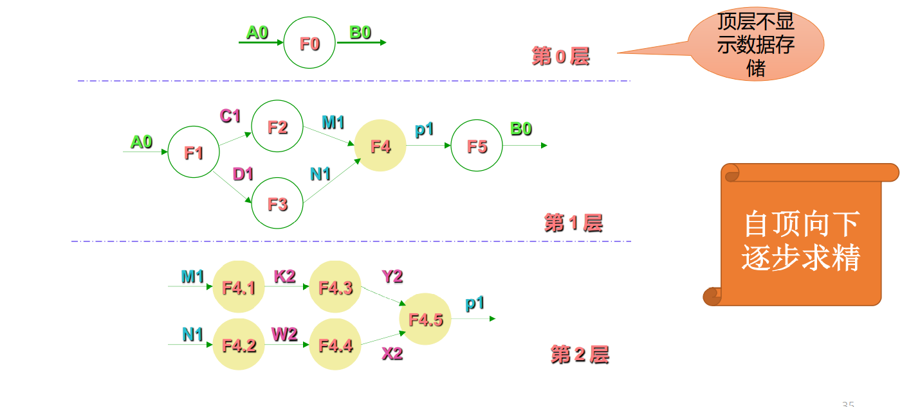
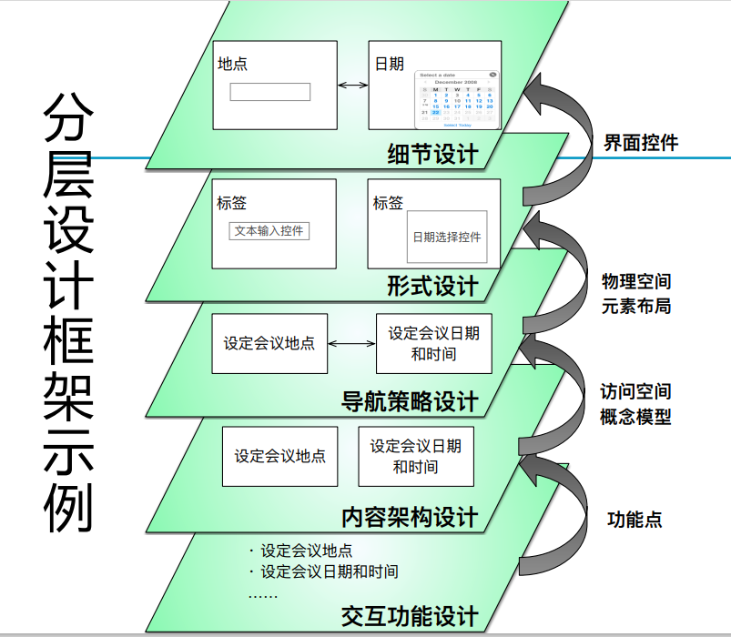
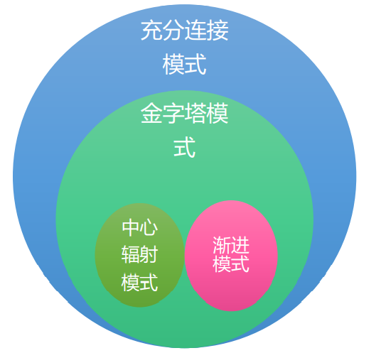

# 人机交互开卷
## Chap1 绪论
### 1.人机交互的主要性
1. 降低产品成本:产品的开发成本和后续维护成本
2. 提高工作效率
3. 降低错误几率
4. 用户满意度决定市场
### 2.发展历史
机器语言-->命令行-->图形用户界面-->多通道交互技术
### 3.趋势
改进人与系统交互方式和效率，提升用户体验。

### 4.小结
* 软件功能决定产品下限，用户交互体验决定产品上限
* 人机交互领域研究如何有效提升用户体验
* 未来的趋势：以用户为中心的设计

## Chap2 感知与认知
### 1. 人的感知
### 1.1视觉
* 人感知世界的最主要方法
* 过程：接受信息-->解释加工
    * 视觉系统的物理特性决定了人类无法看到某些事物。
    * 视觉系统进行解释信息处信息，对不完全信息发挥的一定的想象力。
#### 接受阶段
大小、视敏度、深度、颜色
* 大小：占据人眼视距空间大小。视角大小、物体大小以及距离。
* 视敏度：视距一定，能分辨物体细节的视角越小，视敏度越大。对于较复杂的图形图像和文字的分辨十分重要。
* 深度：依据两眼视差感知深度。熟知大小线索，线条线索，遮挡线索。
* 颜色：**色度**由波长决定、**强度**决定明暗、**饱和度**指色彩鲜艳程度，也称色彩的纯度
  * **颜色模型**：RGB\CMYK\HSV
      * 任何一个颜色模型都无法包含所有的可见光。
      * **RGB**：红绿蓝，用于彩色光栅图形显示设备。主对角线上各原色的强度相等，产生由暗到明的白色
      * **CMYK**：红绿蓝的补色（从白光总减去）：青(Cyan)、品红(Magenta)、黄(Yellow)，以及黑色（blacK）构成。常用于印刷设备。
      * **HSV**：色调（Hue）、饱和度（Saturation）和亮度（Value）
  * **在交互中的应用**：吸引用户注意力、辅助记忆。**避免用于主要特征**。
  * 搭配：前景色与背景色搭配；屏幕内不超过4种；整个界面内不超过7种；对色盲友好的配色。
  * 影响显示效果的外部因素：显示设备与环境明暗。
#### 解释阶段
* 视错觉：眼见不一定为实，人脑会加工采集到的视觉信号。
  * 应用：根据事物在人脑中的反映形态进行设计。
    * 物体组合的方式影响观察者的感知方式
    * 人们会夸大水平线而缩短垂直线
    * 视错觉会影响界面的对称性
    * 重要内容布局偏上。
* 阅读：
  * 字体：
    * 改变字的显示方式（大小写,字体），会影响到阅读的速度和准确性。
    * 通过改变字的特征加以识别：字的显示方式影响阅读的速度与准确性。无衬线更便于阅读（标题），有衬线不便于阅读。

### 1.2听觉
* 信息量仅次于视觉
* **三个属性**：音调（频率）、响度（振幅）、音色（波形）
* **特点**：
  * “引导”视觉
  * “两耳时间差”定位声音方向
  * 与环境的连通性感知更强
  * 听觉适应与听觉疲劳
  * 鸡尾酒会效应（Cocktail party effect）听力选择能力。
* 语音交互：
  * 优点：人们倾向于口头交流、说比写快
  * 缺点：线性任务、听比读慢、不适宜隐私
* **在交互中的应用**：
  * 目的：辅助用户完成任务；提高用户工作效率和用户满意度
  * 原则：符合用户预期（不打扰用户）；表达明确且准确的意义和情绪；良好的声效感官体验（悦耳度、声响、时长）；应作为“辅助”手段。

### 1.3触觉
* 对残疾人很重要，触觉遍布全身。
* 温度-冷热，伤害-痛觉，机械-压力
* 问题：
  * 对触觉的感知是**不精确**的
  * 可穿戴触觉设备的重量影响感知
  * 物体的识别依赖于对此类物体的熟悉程度和接触点的数量
* **在交互中的应用**：增加现场感；减轻视/听觉负担；逼真的训练仿真

### 2. 人的认识
* 获得知识/应用知识的过程，或信息加工的过程，**人最基本的心理过程**。
* **认知过程**：接受外界输入的信息，经过**头脑的加工处理**，形成心理活动，支配人的行为。
* 认知能力与认识过程（注意、记忆等）密切相关
### 2.1 信息处理模型
* 了解人的**信息处理方式**和在**信息感知上的局限性**是良好交互设计的基础
* 研究人对外界信息的接受、存储、集成、检索和使用
### 2.2 注意
**选择性注意**：有选择地加工某些刺激而忽视其他刺激的倾向
### 2.3 记忆
* 一种基本的心理过程，与其他的心理活动密切相关。
* 回忆各种知识以便采取适当的行动
* 三个环节：
  * 识记：信息的输入和信息被编码为大脑可接受的形式
  * 保持：在头脑中再次加工整理，有序组织以便存储
  * 再认和回忆：相当于信息的检索和提取
* 编码越完善、组织越有序、提取也越容易
* 特点：
  * **上下文**也会影响记忆的效果：触景生情
  * **识别**事物的能力远胜于回忆事物的能力：选择题 VS 填空题
  * 对**不同类型**的信息的识别能力不同：擅长识别图片
  * **短时**记忆：7±2 理论 [Miller 1956]
### 2.4 认知心理学
* **格式塔（Gestalt）**心理学：研究人如何感知一个良好组织的模式，而不是相互独立的部分。
* **原则**：
  * **相似性**：人们会将有着相同大小、形状、颜色或方向的元素关联起来
  * **相近性**：人们会将相邻的物体相互关联起来
  * **连续性**：人们倾向于看到由对齐的元素组成的连续线条或曲线
  * **闭合性**：人们倾向于看到简单封闭的区域，对界面元素分组能够形成封闭的区域
### 2.5 用户认知行为模式
* **安全探索；首因效应；够用就好；中途变卦；延后选择；增量式构建；习惯；空间记忆；碎片时间；前瞻记忆；旁人建议**
* 安全探索（Safe Exploration）：
  * 用户不受惊吓、不迷路、不陷入麻烦
* 首因效应（Primacy Effect）：
  * 对**首先看到的事物印象深刻**，并且受其影响更大
  * 人们希望在行为后尽快看到期望的结果，特别是**在交互的初期**
* 够用就好（Sufficing）：
  * 用户会选择第一眼看到的，也许是目标的元素。即在不太费脑的情况下“够用就好”
  * 用户不会**事无巨细地阅读界面的每一个细节**，然后做出最佳决定
* 中途变卦（Changes in Midstream）:
  * 人们会在完成某事的过程中（由于种种原因）改变主意
    * 受到其他事物的吸引
    * 外在干扰导致注意力转移
* 延后选择（Deferred Choices）:
  * 在完成某任务时，对于无关紧要的问题，用户希望过后再回答
    * 人们希望在行为后尽快看到期望的结果
* 增量式构建（Incremental Construction）:
  * 用户在创建事物时，**难以一蹴而就**，而是增量式地构建和不断调整
  * 产生内容的软件界面需要支持该特点
    * 随时、快速保存
* 习惯（Habituation）：
  * 习惯在很大程度上能够帮助提高效率，同时也会成为用户的负担
  * 同操作系统内，软件的常用快捷键和手势操作，以及操作界面等**尽量保持一致**
    * **提供自定义功能**
* 空间记忆（Spatial Memory）：
  * 人们在选择和使用文件时，更倾向与通过回忆位置来再次找到它们，而非其字名称
  * 尽可能使用已经被广泛接受的空间记忆
* 碎片时间（microbreaks）：
  * 人们通常会有碎片时间，并希望做点有意思的事情
  * **软件加载的设计**十分重要：**载入时间是核心评价标准**
    * 不必每次都需要登录授权
    * **避免一次性加载过多的内容**
* 前瞻记忆（Prospective Memory）：
  * 人们在计划将来需要完成的事情是，需要用到前瞻记忆，然后设置提示来提醒自己
    * 标签、注释
    * 可保留窗口
    * 浏览器书签、便签
* 旁人建议（Other People’s Advice）：
  * **人做任何决策都难免直接或间接受其他人想法的影响**
  * 提供方便有效的途径使人们能够看到他人的意见和建议

## Chap3 交互设备
* 输入输出设备的类别，特点及工作原理
### 1. 输入设备
#### 1.1 文本输入
* 键盘：最常见、最主要文本输入方式
  * 机械键盘、薄膜键盘
  * 编码键盘、非编码键盘
  * 人体工程学键盘：
    * 将指法规定的左手键区和右手键区这**两大板块左右分开**，形成**一定的角度甚至坡度**
    * 添加特定快捷键
  * 布局：
    * 布局的好坏影响键盘输入速度和准确性
* 手写输入设备：手写板
  * 在特定区域内，记录笔或手指走过的轨迹，然后识别为文字
  * **压力感应功能**，能测出划过某点、压力多大、倾斜度是多少
  * 电阻式压力、电磁式感应、电容式触控
#### 1.2 图像输入设备
* 二维扫描仪：快速实现图像输入、OCR
* 数字摄像头：动态场景捕捉，动作识别
#### 1.3 三维信息输入设备
* 设备种类
  * 三维扫描仪：实现**三维信息数字化**的一种极为有效的工具
    * 接触式：**探测头直接接触物体表面**
      * 优：较高的准确性和可靠性
      * 缺：测量速度慢、费用较高、探头易磨损
    * 非接触式：
      * 主动：投射能量至物体，由能量的反射来计算三维空间信息
      * 被动：测量由待测物表面反射周遭辐射线
      * 优：扫描速度快，易于操作，磨损小
      * 缺：准确度相对较低
  * 运动捕捉器：用于**捕捉用户的肢体甚至是表情动作**，生成运动模型。
    * 机械式
      * 优：成本低廉
      * 确：由于机械设备的尺寸、重量等问题限制了运动物体的自由运动，因而限制了其应用范围
    * 电磁式
      * 优：速度快，实时性好
      * 缺：易受电磁干扰，对作业场地要求严格
    * 光学式
      * 优：精度高，速度快
      * 缺：价格昂贵，数据处理时间较长
#### 1.4 指点输入设备
* 用于完成一些定位和选择物体的交互任务
* 鼠标：机械式、机械光电式、光电式
* 光笔，控制杆，触摸板，触摸屏

### 2. 输出设备
#### 2.1 显示器
* 主要功能：接收主机发出的信息，经过一系列的变换，最后以光的形式将文字和图形显示出来
* 阴极射线管显示器（CRT），液晶显示器
    * 液晶显示原理：**在充电条件下，液晶能改变分子排列**+彩色滤光片。
#### 2.2 打印机
  * 针式打印机，喷墨打印机，激光打印机
#### 2.3 3D打印机
* 喷墨式，熔积成型，激光烧结
* 以**数字模型**文件为输入，运用特殊蜡材、粉末状金属或塑料等可粘合材料，通过**打印一层层的粘合材料**来制造三维的物体
#### 2.4 语音交互设备
### 3. 虚拟现实设备
* 求计算机可以实时显示一个三维场景，用户可以在其中自由的漫游，并能操纵虚拟世界中一些虚拟物体。
* 输入：三维空间定位设备
* 输出：三维显示设备
#### 3.1 三维空间定位设备
* 空间跟踪定位器、数据手套、触觉和力反馈器
#### 3.2 三维显示设备
* **视觉沟通是多感知虚拟现实系统中最重要的环节**
* 立体视觉
  * 人是通过右眼和左眼所看到物体的细微差异来感知物体的深度，从而识别出立体图像的
  * 1. 使用两套显示设备（组件）分别生成并显示左右眼影像
  * 2. 使用不同角度的偏振光来区别左右眼影像，用户使用偏振光眼镜保持立体影像的同步
* 头盔式显示器
  * 使用小的LCD或CRT屏幕，戴在头盔上，位于人眼几厘米处用在增强现实与虚拟现实系统中
* CAVE
  * 一种四面或六面的**沉浸式虚拟现实环境**
* 裸眼3D显示设备

## Chap4 交互理论与模型
* 分析人机交互
  * 如何交互（具体操作）
  * 交互复杂性
    * 时间复杂性、操作难度、出错概率
### 1. GOMS模型
* GOMS（目标 Goal, 操作 Operator, 方法 Method, 选择Selection）
* 用来**分析用户行为复杂性**的建模技术
* 通过GOMS四个元素来描述用户行为
#### 1.1 GOMS模型定义
* 目标：用户执行任务最终想要得到的结果。
  * 可设置不同层次：高层目标：编辑文章；低层目标：删除字符。
* 操作：任务分析到最底层时的行为，是用户为了完成任务所必须执行的基本动作
  * 双击鼠标左键，按回车键等
* 方法：描述如何完成目标的过程
  * 描述子目标序列及完成子目标所需操作的内部算法
* 选择规则：用户遵守/采用的判定规则，以确定在特定环境下所使用的方法
  * 有多个方法可供选择时，GOMS尽量预测可能会使用哪个方法
#### 1.2 GOMS模型分析过程
1. 确定顶层目标
2. 制定目标完成方法
3. 递归分析标直至分解到最底层操作
4. 基于用户画像设计选择规则
#### 1.3 GOMS模型的局限性
* 缺少对**异常行为**的分析
  * 假设用户是**按照正确的方式进行交互**（假设过强！）
* **只能分析已知**的用户操作方法
  * 假设**用户操作方法**是**已知**的（假设过强！）
* 对任务之间的**关系描述过于简单**
  * 只有顺序关系和选择关系

### 2. 击键层次模型
#### 2.1 击键层次模型（Keystroke-Level Model）
* 目的：量化预测用户完成常规任务的时间
  * 前提条件：
    * 针对特定计算机系统
    * 预测**无错误情况**下**专家用户**在下列输入前提下完成任务的时间
* 组成：操作符、编码方法、放置M操作符的启发规则
#### 2.2 操作符
|   名称和缩写                  |典型值  |          含义        |
|     ----                     | ----  |        ----         |
|击键（Keying）K                | 0.2s  | 敲击键盘或点击鼠标耗时|
|指向（Pointing）P              | 1.1s  | 指向某显示设备位置耗时|
|归位（Homing）H                | 0.4s  | 手在键盘和鼠标间切换耗时|
|心理准备（Mentall preparing）M | 1.35s | 进入下一步的心理准备时间|
|响应（responding）R            |       | 等待计算机响应时间    |
1. 手握鼠标（手初始在键盘上）：H
2. 鼠标指向输入框：P
3. 点击输入框：K
4. 手回键盘：H
5. 输入hci：KKK
6. 敲击回车：K
#### 2.3 编码方式
* 标准编码方式
  * 列出全部操作符
  * 使用[]将操作内容列在操作后
* H[Mouse] M P[Input] K[Mouse] H[Keyboard] M K[h] K[c] K[i] K[Enter] (或4k[hci Enter])
* 0.4+1.35+1.1+0.2+0.4+1.35+4X(0.2) = 5.6
#### 2.4 设置M键的规则（心理准备）
1. 初始插入M键
   * 在**所有K前**插入M键，在**所有P前**插入M键
2. 删除可预期的M键
   * M P[Input] ~~M~~ K[Mouse]
3. 删除同一个认知单元的M键（只保留第一个M键）
   * 例如，命令语句
   * M K[h] ~~M~~ K[c] ~~M~~ K[i] ~~M~~ K[Enter]
4. 删除命令终止符前的M键
#### 2.5 击键层次模型的应用
* 交互设计**早期阶段**为用户性能提供有效、准确的模型
#### 2.6 击键层次模型的局限性
* 缺乏考虑：操作错误、学习性、记忆力、专注和疲劳程度
### 3.费茨（Fitts）定律
#### 3.1 Fitts 定律概述
* 研究目的：了解影响交互行为时长的因素对于提升系统的使用效率至关重要
* **哪些特性**会影响**访问效率**：
  * 预测使用**某种定位设备**指向**某个目标**的时间
  * 根据**目标大小**及至**目标的距离**，计算指向该目标的时间
  * 指导设计人员设计按钮的位置、大小和密集程度
* “最健壮并被广泛采用的人类运动模型之一”
##### 3.1.1 “轮流轻拍 ”实验
* 根据指令尽可能准确而不是快速的轮流轻拍两个薄板
* 记录拍中和失误的情况
* 识别可用于刻画操作困难程度的特征：A，W
##### 3.1.2 Fitts 定律的三个主要指标
* 困难指数ID (Index of Difficulty) = log 2 (A/W+1)
  * 对任务困难程度的量化
  * 与宽度和距离有关
  * 类似香农公式C=W log2 (S/N + 1)
* 运动时间MT (Movement Time) = a + b*ID 
  * 在ID基础上将完成任务的时间量化
* 性能指数IP (Index of Performance) = ID/MT
  * 基于MT 和ID的关系，也称吞吐量
#### 3.2 基于Fitts 定律的设计原则
* **大目标**、**小距离**具有优势
  * 对选择任务而言，其**移动时间**随**到目标距离**的**增加而增加**，随**目标的大小减小而增加**
* 屏幕元素应该**尽可能多的占据屏幕空间**
* 最好的像素是**光标所处的像素**
* 屏幕元素应尽可能利用**屏幕边缘的优势**
### 4. 小结
* 如何评价并改进系统的交互方式？
  * **GOMS**--实现特定任务有哪些交互方式？用户会采取哪种方式？
  * **击键层次模型**--特定交互方式的耗时？
  * **费茨定律**--影响交互行为时长的因素有哪些？

## Chap5 交互设计过程
### 1. 软件开发（交互设计）过程
* **软件开发过程**：方法使用的顺序、要求交付的文档资料、为保证质量和适应变化所需要的管理、软件开发各个阶段完成的里程碑
* 交互设计是软件开发的一部分，也遵循（部分）软件开发过程
* **软件过程模型**：瀑布模型；快速原型模型；增量模型；螺旋模型；统一过程模型
  * 瀑布模型：源于硬件生产设计
    * 顺序性和依赖性
    * 阶段文档审查
    * **优点**：
      * 可**强迫开发人员采用规范化的方法**
      * 严格地规定了每个阶段必须提交的文档
      * 要求**每个阶段**交出的所有**产品都必须是经过验证的**
    * **缺点（限制）**
      * 很可能导致最终开发出的软件产品**不能真正满足用户的需要**（甲方一开始说不清需求）
      * 瀑布模型只适用于项目开始时**需求已确定**的情况
  * 快速原型模型（Prototype）:
    * 先开发一个“原型”软件，完成部分主要功能，展示给用户并征求意见，然后逐步完善，最终获得满意的软件产品
    * 用户往往**难以清晰地表达自己的需求**，尤其是在项目**初期**
    * **尽早提出原型**
    * 分类：
      * **抛弃式原型**：客户不清楚项目范围，不能精确描述需求时使用。引出需求后抛弃这个原型模型。
      * **进化式原型**：
        * 以半运转原型的方式创建出设计方案，然后**随着项目的进展不断变化**，**直到实现最终产品**。
        * 快速实现和提交一个功能有限的版本，可以应付市场竞争的压力
        * 业务和产品需求在不断变化，采用线性开发方式是不实际的
### 2. 以用户为中心的设计方法（User-Centered Design，UCD）
* 一种**设计哲学**（理念）
  * 围绕用户如何能够**完成工作**、希望工作和需要工作来优化用户交互界面
  * **不强迫用户改变习惯**来适应软件开发者的想法
* **原则**：
  * **尽早**关注用户的任务和需求
  * **持续**的平谷以确保界面易用性
  * **迭代**设计
* **UCD方法**：
  * **需求**：
    * 访谈（Interviews）
      * 单独采访，就特定主题**尽可能深入地探索用户观点**
      * 访谈者需为**经过训练的研究者**，需要提前准备一系列简短的问题和可能的回复，能够**引导访谈对象**更好地表达自己
      * 一般会对访谈进行**录音或录像**
      * 访谈后使用扎根理论（Grounded Theory）等方法对访谈结果进行**定性分析**
    * 专题小组（Focus Groups）
      * 以**小组为单位**（一般为4-10人），针对专题或焦点问题进行访谈和讨论，以获得用户的意见和态度
      * 访谈中参与者**相互启发，相互评论**，从而获取**更多**（相较于访谈）**有用的信息**
      * 小组必须由**有经验的人来主持**，使讨论不偏离专题，并避免以一位成员为主的讨论形式，保证大家各抒己见
    * 问卷调查（Questionnaire）
      * 通过问卷获取从**大量用户群体**中获取相关数据
      * 问卷一般以**客观题为主**，主观题为辅
        * 主要用于**问题和观点的验证**
      * **问卷设计**是问卷调查成败的关键
      * 所收集数据用于**定量分析**，具有**统计学意义**
    * 民族志研究（Ethnographic Study）
      * 当研究对象开始正常的日常事务时，对其进行跟踪和记录，即彻底置身于研究对象的文化和日常生活中，**以观察者的身份获取领域知识和用户需求**
      * 应当**深入**理解软件的**实际**应用场景
  * **设计**：
    * 用户参与（User Participation）
      * 用户成为设计团队的一部分
      * 设计过程中**持续咨询和交流**
      * 轮流机制：轮换参与设计团队的用户，**避免用户长期与设计人员相处，提出的建议意见不再是最终用户立场**
  * **测试**：
    * 走查（Walkthroughs）
      * 确定用户的目标（即任务），然后**模拟一个假设情况**的运行来**逐步查看**当前设计文档的内容能否完成该任务
      * 旨在**尽早发现所有在实际使用中可能出现的问题**，可以专注于设计的某一个具体方面或者是关注整个设计
    * 专家评估（Expert Evaluations）
      * **易用性专业人员**通过使用来自于易用性以及人类因素的研究和著作的**启发式或指导性准则**进行实施的
    * 易用性测试（Usability Testing）
      * 参与者**使用系统执行特定任务**，测试者分析和评估整个任务执行过程
      * 测试设计
        * 设计任务、场景、度量准则等
        * 选择参与者、测试者和观测者
        * 确定时间、地点
      * 测试执行
        * 预备测试
        * 观察记录测试过程
      * 数据处理
### 3. 总结
**需求分析**-->**设计**-->编码-->**测试**-->维护

## Chap6 需求工程
### 1. 需求分析的问题和挑战
#### 1.1常见问题
* 用户**难以说清自己的需求**
* **无法准确地理解**从用户方面获取的需求
* 需求的记录总是杂乱无序的
* 在需求验证方面所投入的精力太少
* 总是被改变所驱使，而**没有有效的机制驾驭改变**
* 错误共识效应（False-Consensus Effect）
  * 一种**认知偏见**：人们总是高估自己持的观点、信念、偏好。即人们会以为别人持有和自己相同的观点。
* 表达偏差：脑中想的内容与所表达事物的偏差
### 2. 需求类型与层次
* 需求分类
* 
  * 用户需求、功能需求、非功能需求、约束条件
* **用户需求**（User Requirements）：
  * **定义**：从**用户的角度**描述其为了完成特定目标所必须实现的目标和任务。通常**只涉及系统的外部行为**，而**不涉及系统的内部特性**
  * 会受**业务规则**及**法律法规**的影响
* **功能需求**（Functional Requirements）：
  * **系统在特定条件下采取的能够满足用户需求的行为**
  * 一般能够通过明确的输入和输出来进行刻画
  * 满足功能需求是软件产品**成功的必要条件**
* **非功能需求**（Non-Functional Requirements）:
  * **质量属性方面的要求**：例如响应时间、数据精度、安全性、可靠性等
  * （在满足功能需求的基础上）满足非功能需求是软件产品成功的**充分条件**
* **约束条件**：
  * 开发人员在设计和构建产品时需考虑的限制：例，系统需能够部署在Linux服务器上
### 3. 需求工程过程
* 需求获取-->初始需求
* 需求分析-->系统需求
* 文档化-->文档
* 需求验证-->有效需求
#### 3.1 需求获取
* 确定需求来源:系统干系人/涉众(Stakeholder)；现有文档；现有系统
* 需求收集方法：观察式、启发式
#### 3.2 需求分析
* **初步分析抽取的用户需求≠系统需求**
* 冰山理论：显性需求（10%）、隐性需求
* 分析任务
  * 确定该系统边界和交互环境
  * 需求质量保障
    * 一致性（前后一致）、完整性（避免后改）、无歧义（理解歧义）等
  * 需求分类
    * 功能需求、非功能需求
  * 冲突检测与需求协商
  * 评定需求优先级
* **需求优先级分析**（KANO模型）
  * 基本需求
  * 期望需求
  * 兴奋性需求

* 一般需求优先级排序考虑因素
  * 重要性，成本，损失，持续时间，风险，不稳定性。
  * 方法：
    * 面向对象分析（用例图）
    * 面向主体的分析方法（目标模型）
    * 结构化分析方法（数据流图）
      * 从**数据传递和加工的角度**，以图形的方式刻画数据流从输入到输出的移动变换过程。
      * 
      * 外部实体：软件系统外的信息产生者（数据输入源）或消费者（数据输出源）
      * 加工：数据的变幻和处理以产生输出数据。广义上可以指任何计算机操作。
      * 数据存储：数据库文件或任何形式的数据组织
      * 数据流：描述被加工数据及其流动方向

#### 3.3 文档化
* 需要文档化的信息
  * 原始需求
  * 需求协商和决策过程
  * 需求评审和演化过程
  * 需求制品
    * 自然语言+概念模型
    * 完整性、正确性、无二义性、一致性
    * 可理解性、可追踪性、可验证性
#### 3.4 需求确认
* 需求评审
  * 系统利益相关者参与的，**针对需求文档**的评审活动
* 需求原型
  * **通过动画、界面原型**等方式向利益相关者展示开发团队当前对于系统软件需求的理解，获取反馈

## Chap7 交互界面设计
### 1. 交互界面设计框架
* 核心原则：**关注点分离**
* 基于**分层框架**的设计方法：逐层进行设计，每一个层关注界面设计的一个特定方面
#### 1.1 分层设计框架
* 功能层
  * 设计界面所需实现的功能
  * **源自需求分析**
* 架构层
  * 确定界面的内容模块，及模块之间的连接
  * 每个内容模块是一个相对**独立的访问空间**，支持用户执行特定界面功能
* 导航层
  * 用户在访问空间之间**移动的路径**
* 形式层
  * **内容呈现形式（控件）及布局**设计
  * **交互形式**设计
* 细节层
  * 界面元素的**详细样式**设计

### 2. 架构设计
* 架构是**功能模块和它们之间关系的抽象概念**
* 用户与**功能模块**交互的基础是用户**访问不同的“空间”**来执行任务和完成目标
* 访问空间划分
  * **基于功能模块及其之间的关系**，划分访问空间
  * 一个访问空间包含**一个或多个功能**
* “物理化” 访问空间
  * 从概念空间到物理空间的转换
  * 一对一&一对多
### 3. 导航设计
* 访问空间之间的跳转/移动路径设计
  * 制定物理空间之间的**导航策略**
* 导航提示
  * 用户知道自己在哪里
  * 用户知道从哪里来到当前页面
  * 用户知道接下来要去哪里
  * 用户知道怎样到达那里
#### 3.1 导航策略设计
* **常用导航模式**
  * 渐进模式；中心辐射模式；金字塔模式；充分链接模式

#### 3.2 导航路标
* 清晰地展示：
  * 当前浏览位置
  * 到达当前位置的路径
  * 所要进入的页面
##### 3.2.1 序列地图导航
##### 3.2.2 面包屑导航
### 4. 形式设计
内容的呈现形式及布局
* 布局模式
  * **内容分组**
    * 中心舞台模式；对等网格模式；标题区域模式
  * **内容分组和隐藏**
    * 标签模式；手风琴模式；可收起面板模式
  * **位置关系**
    * 对齐模式；对角线平衡模式
  * **易用性**
    * 可移动面板模式；流体布局模
* **模式**是一套被反复使用、验证有效的、经过分类编目的、**经验的总结**
* 旨在**复用设计知识，简化设计工作**
### 5. 细节设计
#### 5.1 控件选择
* 控件类型：**根据界面功能选择适当控件**
  * 选择及分组控件：按钮、菜单
  * 文本控件：文本框、文本域
  * 导航控件：滚动条、选项卡（Tab）
  * 容器控件：对话框、面板
  * 输出控件：标签、进度条
* 表单控件
  * 在界面设计中主要负责数据收集功能，即获取用户输入
  * 包含：表单标签、表单域、及表单按钮
  * 常用控件
    * 内容选择；文本输入；数字输入；日期和时间输入
#### 5.2 易用性设计
* 结构化的格式（Structured Format）
* 填空（Fill-in-the-Blanks）
* 输入提示（Input Hints）
* 内联提示（Inline Prompt）
* 自动完成（Auto Completion）
* 良好默认值（Good Defaults）
* 同页错误信息（Same Page Error Messages）
* 密码输入（Password Input）
  * 默认使用密码控件
  * 密码可见
  * 即时反馈
#### 5.3 色彩搭配模式
* 单色模式；相近色模式；补色模式；自定义模式

## Chap8 Web开发技术
### 1. Web界面（前端）开发技术
#### 1.1 HTML（HyperText Mark Language）
超文本标记语言
* 将**文本内容**与**文本结构**和**表现信息**结合在一起，**使用标记进行识别**
* 匹配的标记及其所包围的内容成为一个**页面元素**
* 元素由**开始标记、内容和结束标记**组成
* 块元素与内联元素
  * 块元素将显示内容分块（前后**自带换行**）
  * 内联元素与其他显示内容**无缝融合**
* HTML文件由\<**head**>元素和\<**body**>元素组成
* \<head>存放网页基本信息：网页名称，字体编码等
* \<body>存放网页中显示的具体内容：通过使用恰当的元素，实现特定网页界面
* 页面元素样式
  * 使用style属性来描述元素内容的样式
* **HTML版本历史**：
  * HTML1.0-->HTML2.0-->HTML3.0-->HTML4.0-->HTML5
#### 1.2 CSS层叠样式表（Cascading Style Sheet）
* 为标签语言（html、xml等）添加样式（字体、颜色、间距等）的样式表语言
* **样式继承**：不是所有样式都能够按照元素结构进行继承
* CSS子元素选择器；CSS类选择器
#### 1.3 前端开发工具
* HTML开发工具
  * 辅助文本编辑：Chrome Developer Tool
  * 所见即所得：Dreamweaver
* 文档编辑工具
  * latex VS word
#### 1.4 前端页面互动 JS
* **JavaScript(JS)**
  * 一种解释型编程语言
  * 可以为HTML页面添加交互操作
  * 与CSS类似，可以内嵌于HTML文件中，也可以写成单独的js文件（推荐）
  * 可跨平台运行，被绝大部分浏览器支持
* **与HTML交互原理**
  * 浏览器在处理HTML时，会为标记创建对象，形成**文档对象模型**
  * JS通过与DOM交互来访问其元素，对其内容进行操作
  * 浏览器会动态更新HTML网页以显示更新后的内容

### 2. Web服务器（后端）开发技术
* 服务器动态开发技术
  * 在HTML的结构基础上**使用编程语言动态生成内容**
    * JSP；ASP.NET；PHP；Python；Node.JS
  * Web系统架构
  * 用户<-->web服务器<-->数据库服务器
  * -->发送请求 <--返回数据

## Chap9 可用性评估与测试
### 1. 可用性：
* 定义：指特定的用户在特定的环境下使用产品并达到特定目标的**效力、效率和满意的程度**
* 增强可用性意义：
  * **增加用户的满意度等**
  * 用户的最终需求在于使用产品以完成某种功能
### 2. 可用性设计原则评估
#### 2.1 可学习性
* **可预见性**：用户利用以往的交互经验就能够确定当前交互操作的结果
  * 位置、功能、操作、流程
* **同步性**：依据界面当前状态评估过去操作造成影响的能力
* **熟悉性**：新系统与旧系统的相似程度
* **通用性**：与同一平台、同一中软件交互体验的一致性

#### 2.2 灵活性
* **可定制性**：用户或系统修改系统界面或功能的能力
* **多线程**：允许各自独立交互任务中的多个交互同步进行
* **可互换性**：任务的执行可以在系统控制和用户控制间进行转移
* **可替换输入/输出**：多种类型的输入与输出

#### 2.3 鲁棒性
* **可观察性**：允许用户通过观察交互界面的表现来了解系统的内部状态
* **可恢复性**：当发生错误时能够进行更正和恢复的能力
* **响应性**：系统对状态改变做出反应的延迟时间和表现
* **任务规范性**：系统为完成交互任务所提供的功能是否规范

### 3. 用户测试
* 定义：让用户**在真实的场景下，真正地使用软件系统**，由试验人员对实验过程进行观察、记录和测量
* **小样本**，以**发现问题为主**要目的
* 深入理解用户的使用习惯和方式
* 重要性：
  * 人机交互设计不可能完美，**问题不可避免**
    * 难以考虑到所有的情况；设计时间有限；存在冲突的设计原则
  * 观看用户使用产品**对设计师大有裨益**
* （见PPT）很少有人进行可用性测试；测试他人的交互界面；可用性相关的基本问题
#### 3.1 可用性测试流程
* 准备测试环境与测试设备
  * 大多数用户使用这款产品时的正常环境
  * 尽量减少测试人员（或其他人员）对测试用户的影响
  * 如果有可能的话使用专门的**可用性实验室**
  * 硬件&软件
* 制定测试计划
  * 制定测试目标
  * 明确研究问题
  * 选择测试任务
  * 设计测试场景
  * 确定需收集数据
* 招募测试者
  * 宽松招募；寻找测试者；遴选测试者；储备测试者；奖励机制
* 执行测试
  * 测试准备
    * **场地说明**：屏幕录像、有其他观测者、测试数据用途、**签署知情书**
    * **强调测试**：即有**问题是系统的问题**，**不是测试者的问题**
  * 测试实施
    * 介绍测试场景
    * 说明测试任务
    * 测试者执行任务
  * **有效引导测试者--主持人**
    * 引导参与者关注在测试相关的事务上
      * **保持中立**
    * 实时提醒参与者用语言描述其想法
      * 引导**发声思维**
* 撰写测试报告
  * 分析可用性问题
  * 汇编和总结测试中获得的数据
### 4. A/B测试
* 定义：为同一个目标**制定两个方案**，让一部分用户使用 A 方案，另一部分用户使用B 方案，记录下用户的使用情况，看哪个方案更符合设计
* **定量分析**：通过**科学的实验设计**、采样样本代表性、流量分割与小流量测试等方式来获得具有代表性的实验结论，并确信该结论在推广到全部流量可信
#### A/B测试工具
* 主要功能
  * 辅助生成不同测试版本
  * **流量分割**
    * 尽量保证试验用户流量的代表性和试验数据的准确性
    * 同时支持试验流量动态控制、多变量组合试验、大量并行试验、针对特定人群的定向试验
  * 试验状态查看与管理
  * 生成数据报告

需要打印的内容：
chap2 P15~17,37,38,44,45,47~49,51~62
chap3 30~34
chap4 p9~11,13~15,32,34,35
chap5 P5,8
chap6 P11,13,14,16,18,19,24,36,37,39~41

## 一、物理地址映射
### （一）、数据结构
### （二）、地址转换
#### 1. PGD_t 
* 1.sdlkajdglasdjf 
  * dfsdf
    * sdfasd
      * edfa
##### (1)
dadfasdf