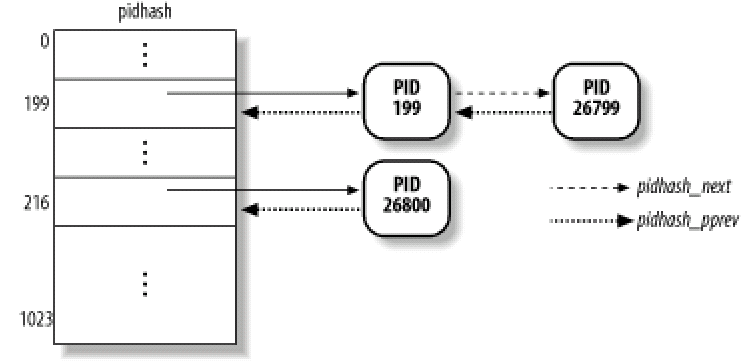

# Linux复习
## Chap1 Linux系统概述
* Linux系统特点
* Linux系统组成
* 什么是POSIX标准？为什么现代操作系统的设计必须遵循POSIX标准
* 什么是GNU？Linux与GNU有什么关系
* Linux内核由哪几个子系统组成？各子系统的主要功能是什么？能够写出各子系统之间的关联
* 能够认识Linux内核版本

### 1. Linux的起源与发展
* 操作系统原型/内核：**进程切换+文件系统+设备驱动程序**
* Linux之父：Linus Tovalds

### 2. 自由软件与GPL
* 自由软件：允许自由地**使用、复制、修改、分发**的软件，软件的**源代码必须是可得到的**。
* **POSIX**：Portable Operating System Interface Standard
  * 基于Unix的可移植操作系统
  * 一套标准的操作系统接口和工具
* GNU：GNU's Not Unix
  * 由自由软件基金FSF赞助的项目
  * 开发一个完全自由的，UNIX类型的操作系统，成为GNU
* GPL：General Puclic License
  * 保证自由软件对所有用户都是自由的
  * 所有GNU软件和派生工作都遵循GPL
  * GPL类软件都**遵循一定规则**：
    * 传播者不能限制购买软件的用户自由权。如果用户买了一套GPL软件，就可免费复制、传播或出售。
    * 传播者必须清楚告诉用户该软件属于GPL软件。
    * 传播者必须免费提供软件的完整源代码，且任何用户能以源代码形式将软件复制或发布给别的用户。
    * 如果用户的软件使用了受GPL保护的任何软件的一部分，则该软件也成为GPL软件，它必须随应用程序一起发布源代码。
* GNU与Linux：
  * **Linux内核的开发工作都是基于GNU推出的自由软件完成的**。Linux与GNU相辅相成
    * Linux：内核
    * GNU/Linux:操作系统名称
      * Linux中的窗口管理工具，编译器，shell等都是GNU软件。
### 3. Linux系统的主要特点
* Linux是一套**免费**使用，遵循**GPL、POSIX标准**的、**与UNIX兼容**的操作系统
* 具有**良好的可移植性**
* 可运行于**多种平台**(是目前**支持硬件最多**的操作系统)
* 具有**现代操作系统**的所有内容：
  * 抢占式多任务处理，多用户
  * 内存保护
  * SMP，TCP/IP
  * 支持绝大多数的32位/64位CPU
* NFS，VFS，EXT文件系统
* 成熟的企业应用、服务器级操作系统、嵌入式领域
* 设备独立性、丰富的网络功能、性能高和安全性强、便于定制和再开发
* 杰出的学习系统


### 4. Linux系统及内核的组成
* Linux**系统组成**：
  * 用户进程、系统调用接口(OS服务层)、Linux内核、硬件层
* Linux**内核组成**：
  * 进程调度程序
    * 负责控制进程访问CPU。确保所有的进程都能公平访问CPU。
  * 内存管理程序
    * 使多个进程可以安全地共享机器的主存系统，并支持虚拟内存。
  * 虚拟文件系统
    * 提供一个所有设备的公共文件接口， 抽象了不同硬件设备的细节
  * 网络接口
    * 提供对多种网络协议标准和网络设备的访问。
  * 进程间通信
    * 进程间通信支持进程之间的通信，Linux支持进程间的多种通信机制。这些机制可协助多个进程、多资源的互斥访问、进程间的同步和消息传递。
* **内核间关系**：
  * **进程调度**与**内存管理**：**互相依赖**。在多程序环境下，程序要运行，则必须为之创建进程，而创建进程的第一件事情，就是将程序和数据装入内存。
  * **进程间通信**与**内存管理**：**进程间通信要依赖内存管理**支持共享内存通信机制。这种机制允许两个进程除了拥有自己的私有空间之外，还可以存取共同的内存区域。
  * **虚拟文件系统**与**网络接口**：**虚拟文件系统利用网络接口**支持网络文件系统（NFS），也利用内存管理支持RAMDISK设备。
  * **内存管理**与**虚拟文件系统**：**内存管理利用虚拟文件系统**支持交换，交换进程定期由调度程序调度，这也是内存管理依赖于进程调度的原因。当一个进程存取的内存映射被换出时，内存管理向虚拟文件系统发出请求，同时，挂起当前正在运行的进程。
  * 除了这些依赖关系外，内核中的所有子系统还要依赖于一些共同的资源。这些资源包括所有子系统都用到的API，如分配和释放内存空间的函数、输出警告或错误消息的函数及系统提供的调试接口等。

* Linux**内核特征**：
  1. 使用单一内核结构
      * 可以动态装入和卸载内核中的部分代码，称为模块
  2. 进程调度方式简单有效
  3. 动态加载内核模块
  4. 支持对称多处理机制
  5. Linux内核可以抢占
  6. Linux对线程的支持


### 5. Linux版本
* 内核版：稳定版&测试版
* 发行版：内核+tools
* Linux内核采用双树系统：
  * **稳定树**：主要用于发行。修正Bug，加入新设备驱动
  * **开发树**：用于产品开发，变化快。
* 内核版本号：$r.x.y$
  * 主版本号.从版本号.修订版本号.(稳定本号)
  * **“从版本号”**：偶数为稳定版；奇数为测试版。

### 6. Linux内核源代码组织
* **源代码位置**：/usr/sr/linux
* 组织方法：树形结构组织
  * arch:所有体系结构的相关的核心代码
    * 每个体系结构子目录下包含几个主要子目录：
    * kernel与体系结构相关的**核心代码**。
    * mm内存管理
    * lib库代码
  * include：用来编译的头文件
  * init：内核初始化代码
  * mm：**独立于CPU体系结构**的所有内存管理代码
  * modules：仅包含已建好的模块
  * fs：文件系统
  * kernel：核心模块。包括进程管理和调度的主要核心代码。中断，时钟，同步机制
  * net：网络部分
  * lib：核心库代码
  * script：用于编译时的脚本文件
  * drivers：所有设备的驱动
  * ipc：内核的进程间通讯
* 每个目录下的'.depend'和'makefile'文件在编译时使用

### 7. Linux与其他系统的区别
* MS-DOS与Linux
  * 单任务操作系统/多任务操作系统
* Windows与Linux
  * 封闭有偿/开放免费
  * Linux：软件丰富，稳定性好，硬件适应强，网络功能丰富。

### 8. Linux中的C语言与汇编语言
* 汇编语言文件'.s'
* 已预编译的汇编语言文件'.S'
* 编译后的目标文件'.o'
* Linux源代码中的C语言代码：
  * 使用GNU的C语言编写
  * 从C++中吸收了'inline'和'const'
  * 支持“属性描述符”(attribute)
  * 增加新数据类型'long long int'，用于支持64位CPU
* Linux源码中的**汇编语言**：'.s'文件与嵌入C中的
  * 汇编采用AT&T格式，非Intel格式

* 汇编嵌入C语言中
  * AT&T行内汇编：关键字'asm()','\_asm\_()'
  * GCC处理汇编时，奖asm括号中的汇编代码拷贝到汇编文件中。
* 扩展行内汇编
  * :output_regs    //输出寄存器说明
  * :input_reg      //输入寄存器说明
  * :clobbered_regs //被改变的寄存器

## Chap2 Linux进程管理
* 理解进程控制块tast_struct的作用，重要字段的含义
* Linux进程的状态类型？变化情况？建寺状态的进程如何处理？
* Linux 2.4进程的系统堆栈，Linux2.6进程的系统堆栈
* Linux进程间的家庭关系
* 进程组织所涉及到的数据结构（进程链表、运行队列、等待队列、pidhash表）的作用
* Linux的进程控制：相关函数的作用、执行过程
  * fork():sys_fork()/sys_clone()/vfork()的区别
  * exec()
  * wait()
  * exit()
* 什么是写时复制技术
* 结合do_fork()的源代码理解父进程创建子进程的过程

### 0. 进程与线程
* **进程**
  * 定义
    * **程序的一次执行**及其所**包含资源**的总称
  * 性质
    * 每个进程具有一定的**功能和权限**，运行在**独立的虚拟地址空间**中
    * 进程时系统**资源分配的基本单位**，CPU**调度的基本单位**
    * 用PCB表示
* **线程**
  * 进程中的活动对象
    * 有独立程序计数器，进程栈及一组进程寄存器
* 一个进程包含多个线程
* 进程是**资源分配**的基本单位；线程是**处理器调度**的独立单位
* 内存
  * 正文段、进程数据段、系统堆栈

### 1. Linux进程描述
* task_struct
  * 使用task_struct描述一个进程，代表一个进程的PCB
  * 定义于/include/linux/sched.h
  * task[NR_TASKS], NR_TASKS(系统可记录进程数) = 512


### 2. Linux进程状态与转换
* task_struct中的state表示进程当前状态
* **状态**：
  * TASK_RUNNING; TASK_INTERRUPTIBLE; TASK_UNINTERRUPTIBLE; TASK_STOPPED; TASK_TRACED; TASK_ZOMBIE; TASK_DEAD
  * **2.6相较2.4新增状态**：TASK_TRACED, TASK_DEAD
* **运行态/就绪态**
  * **TASK_RUNNING**：**正在运行或**已处于**就绪**只等待CPU调度
    * 由**current指针指向当前运行的进程**。
  * **TASK_TRACED**：供调试使用
* 被挂起态
  * **TASK_INTERRUPTIBLE**：**可**被信号或中断唤醒进入就绪队列
  * **TASK_UNINTERRUPTIBLE**：等待资源**不可**被其他进程中断
  * **TASK_STOPPED**：被调试暂停，或收到SIGSTOP等信号
* 不可运行态
  * **TASK_ZOMBIE**：**正在终止**(已结束，已释放内存、文件等资源，**但其父进程未接到通知，描述符未释放**)，**等待父进程通过wait4()或waitpid()回收**
  * **TASK_DEAD**：已退出且不需父进程回收的进程的状态
* 进程转换
  * 运行进程申请资源无效时：
      * **sleep_on()/sleep_on_timeout()**:TASK_RUNNING $\to$ TASK_**UN**INTERRUPTIBLE
    * 转到**UN**INTERRUPTIBLE一般是**硬件资源**，申请不到则执行不下去。**不能**由signal信号或时钟中断唤醒回到TASK_RUNNING状态
  * 申请资源或运行中出现某种错误时
    * **interruptible_sleep_on_timeout()**TASK_RUNNING $\to$ TASK_INTERRUPTIBLE
    * 系统**给进程一次重新运行**的机会。等待规定的时间片长度,再重新试一次。
  * wake_up()
    * TASK_INTERRUPTIBLE:进程资源有效时使用:wake_up(); wake_up_interruptible(); wake_up_process()唤醒
    * TASK_UNINTERRUPTIBLE:不能由signal信号或时钟中断唤醒,只能由wake_up(); wake_up_process()唤醒


### 3. Linux进程标识与组织
* pid
  * 功能
    * 用于**标识进程**
    * **pid与进程描述符一一对应**
  * 数据结构
    * pid_t是一个int数据类型:0~32767
  * 生成新pid:get_pid()。+1，循环
  * 获取进程pid:ps命令；getpid()-->sys_getpid()
* tgid 进程组标识
  * 功能
    * 进程是否属于同组
    * **组ID是第一个组内线程（父进程）的ID**
    * **线程组**中的**所有线程共享相同的PID**
      * **单线程**进程：**tgid和pid相等**
      * **多线程**进程：组内所有线程**tgid都相等=父进程pid**
* 用户相关进程标识符
  * 用户标识uid及组标识gid
  * 有效用户标识euid及有效组标识egid
  * 备份用户标识suid及备份组标识sgid
  * 文件系统标识fsuid及文件系统组标识fsgid
  * **通过getXXX()获取**


### 4. Linux进程的系统堆栈
* 每个进程都要**单独分配一个8KB大小的系统堆栈**，存放进程描述符task_struct和内核堆栈。
  * task_struct：8k低端(约1k大)
  * 内核堆栈：8k高端。进程处于内核态时使用
* 8192($2^{13}$)字节，占两个连续页框。第一个页框起始地址为$2^{13}$倍数
* 进程**个数限制**：
  * 所有进程的PCB及系统堆栈占用空间≤1/2的物理内存总和

  * 便于根据esp指针获取current指针(因为是$2^{13}$的倍数只需要将低13位清零)
  * `current = (struct task_struct(*)STACK_POINTE&0xFFFE000)`
* 进程描述符管理
  * 分配：alloc_task_struct()
  * 回收：free_task_struct()
  * 访问：get_task_struct()
* **Linux2.6**
  * 使用struct thread_info(约52Byte，其中的task成员指向task_struct)替换task_sturct
  * THREAD_SIZE根据内核配置可以是4k或8k大。从esp获取current时分别位12位和13位
  * 原因分析
    * PCB中最**频繁被引用**的是thread_info。
    * 进程的PCB中的内容越来越多，所需空间越来越大，使得留给内核堆栈的空间过小，所以将部分进程控制块移出这个空间，只在核心栈保留了访问频繁的thread_info.

### 5. Linux进程的链表结构
* 进程链表
  * 所有进程链表、运行队列、等待队列、pidhash表
* 所有进程链表
  * 通过*prev_task和*next_task组成一个**双向循环列表**，头和尾都是init_task，在运行中保持不变。
* 运行队列
  * TASK_RUNNING组成的**双向循环链表**，run_list开头
* pidhash表
  * 知道进程pid，可以通过哈希表快速找到进程。

* 等待队列
  * 由TASK_INTERRUPTIBLE和TASK_UNINTERRUPTIBLE组成
  * 等待队列的数据结构
```C
struct __wait_queue{
  unsigned int flags;
  struct task_struct *task;
  struct list_head task_list;
};
```
  * 互斥进程(flag=1)由内核有选择地唤醒
  * 非互斥进程(flag=0)总是由内核在事件发生时唤醒
* TASK_STOPPED和TASK_ZOMBIE进程通过pid或亲属关系检索


### 6. Linux进程的家族关系
* 所有进程**都是init进程(pid=1)的后代**
* 每个进程**必须有一个父进程**
* 每个进程**可以拥有零个或者多个子进程**
* 具有**相同父进程的进程称为兄弟**
* 进程间的父子关系采用树型组织
  * p_opptr : original parent  (1号进程或者创建它的父进程)
  * p_pptr: 父进程，有时候是调试时的调试监管进程
  * p_cptr: child (指向自己最年轻的子进程)
  * p_ysptr：指向比自己年轻的兄弟进程
  * p_osptr：指向比自己老的兄弟进程

  * 进程创建时**p_opptr和p_pptr是一致的**。在**运行中p_pptr可以暂时地改变**
  * 一个进程通过系统调用**ptrace()**来跟踪另一个进程时，**被跟踪**进程的**p_pptr指针指向正在跟踪它的进程**，跟踪进程暂时成为被跟踪进程的养父。
  * 一个进程在其子进程之前去世时。若当前进程是一个线程，p_opptr指向同一线程组的下一个线程。否则，p_opptr指向init进程，init进程相当于孤儿院。
* 0号进程
  * 是**所有进程的祖先**。在**OS启动时创建**。由他执行**cpu_idle()**函数。没有进程处于TASK_RUNNING时，调度0号进程
* 1号进程
  * init进程，由0号进程创建。
  * 首先创建一些后台进程来维护系统，然后进行系统配置，执行shell编写的初始化程序。然后转入用户态运行
* 获取父进程：current->parent
* 获取所有子进程(遍历子进程链表)


### 7. Linux进程控制
* 进程的创建、执行、等待、终止
* 0号进程
  * 维护Linux**内核代码段、数据段及堆栈**
  * 唯一一个通过**静态分配**创建的进程
  * start_kernel函数初始化内核所需所有数据结构、激活中断、创建1号内核线程
* 1号内核进程
  * 0号进程调用rest_init创建
  * 执行init()函数
    * 实现从内核态到用户态的切换
    * 为常规内核任务初始化一些必要内核线程:kflushd,kswapd
    * 调用系统调用execve()装入可执行程序init
* 传统UNIX系统中子进程复制父进程的所有资源
  * 创建过程慢、效率低，很多资源用不到
  * 改进：写时复制、sys_fork()sys_clone()/sys_vfork()、轻量级进程允许父子进程共享多个数据结构，阻塞父进程

* 写时复制
  * 父进程的资源被设置为**只读**，当父进程或子进程试图修改某些内容时，内核才在**修改前将该部分进行拷贝**
  * fork()
    * 只复制父进程的页表，通过页表项共享页面，页表项均标志为只读。
    * 为子进程创建唯一PCB
    * **逻辑拷贝**整个进程的地址空间，仅当**试图修改页面才真正的拷贝**
* 进程创建：sys_fork()/sys_clone()(轻量级线程)/sys_vfork()
  * 都调用同一内核函数do_fork()
> do_fork(unsigned long clone_flag, unsigned long stack_start, struct pt_regs *regs, unsigned long stack_size, int _user *parent_tidptr, int _user *child_tidptr)；
> clone_flag：子进程创建相关标志；stack_start：将用户态堆栈指针赋给子进程的esp；regs：指向通用寄存器值的指针；stack_size：未使用（总设为0）；parent_tidptr：父进程的用户态变量地址，若需父进程与新轻量级进程有相同PID，则需设置CLONE_PARENT_SETTID；child_tidptr：新轻量级进程的用户态变量地址，若需让新进程具有同类进程的PID ，需设置CLONE_CHILD_SETTID
* sys_fork()
  * 子进程**完全复制父进程的资源**
  * 子进程的**执行独立于父进程**
  * **专门的通信机制来实现进程间数据共享**
  * 父进程执行fork()返回子进程的PID值
  * 子进程执行fork()返回0
  * 调用失败返回-1
* sys_vfork()
  * 子进程与父进程**共享地址空间**
  * 子进程作为父进程的**一个单独线程在其地址空间运行**
  * 子进程从父进程继承控制终端、信号标志位、可访问的主存区、环境变量和其他资源分配
  * 子进程对虚拟空间任何数据的修改都可为父进程所见 
  * **父进程将被阻塞**，直到子进程调用execve()或exit()
  * 与fork()**功能相同**，**不拷贝父进程的页表项**
  * 子进程只执行exec()时，vfork()为首选
* clone()
  * 创建轻量级进程(LWP)的系统调用
  * 通过clone_flag控制
* sys_fork():**除了代码段**外，**父子进程不共享任何东西**（各自有一份）
* sys_clone():有**选择地对父进程进行复制**，可根据提供的clone_flags决定共享的内容
  * 不提供标志时sys_clone()与sys_fork()相同
* sys_vfork():在写时复制出现后基本不用
  * vfork()创建的新进程共享父进程的内存地址空间。通过复制指针的方法使子进程与父进程的资源实现共享。
  * **父进程在这个过程中被阻塞**，直到子进程退出或者通过exec()执行一个新的程序(租用父进程的地址空间)。因此，sys_vfork()保证子进程先运行，在它调用exec()或exit之后父进程才可能被调度运行.  可以理解为：**vfork创建新进程的目的是exec()一个新进程**。
* 多数情况，子进程从fork()返回后调用exec()函数来执行新的程序
  * exec，新程序替代程序段，从main()开始执行
  * exec不创建新进程，前后进程ID不变，但用另外一个程序替代当前进程的正文、数据、堆栈等

* 创建子进程后
  1. 父进程不理睬子进程，继续执行。如果子进程先于父进程消亡的话，则内核会发送一个信号，通知父进程。
  2. 父进程暂停，睡眠，等待子进程结束后继续运行
  3. 父进程自行结束，使用exit()
* wait()
  * 父进程调用检查子进程是否终止
  * 父进程调用wait()后进入阻塞队列中。子进程结束时会产生一个终止状态字，系统内核再向父进程发出SIGCHILD信号。当接收到信号时，父进程提取子进程的终止状态字，从wait()返回到原程序。
* wait()作用
  * 获取子进程终止的消息
  * 清除子进程的所有独占资源

* 撤销时机
  * 主动撤销：执行完代码，通知内核释放进程的资源
  * 被动撤消：内核强迫杀死进程
    * 进程接收到一个不能处理或忽视的信号
    * 在内核态产生一个不可恢复的CPU异常，而内核此时正代表该进程在运行

* 终止进程：exit()


### 8. Linux进程与线程实现


## Chap3 Linux进程调度
* Linux的进程调度方式有哪些？
* 静态优先级、动态优先级、counter的作用
* 普通进程和实时进程调度
* Linux的三种调度策略
* do_fork()中的父子进程的优先级，时间片的设置有什么特点
* 调度时机有哪些，都是如何实现的
* 调度时优先级的重新计算方法，计算时间
* Linux2.6进程调度特征分析，与Linux2.4的区别
2.4 O(n), 2.6 O(1)

## Chap4 系统调用与中断
* 什么是系统调用？为什么要引入系统调用
* INT 0X80指令的作用
* 结合system_call理解系统调用的整个执行过程
* 系统调用表的组织结构？系统调用号的作用
* 系统调用的参数传递方法
* **不要求**：
  * 描述一个添加系统调用的步骤。


## Chap5 Linux中断处理
* 什么是快中断？什么是慢中断？为什么要进行区分？各自的特点是什么？
* 为什么要引入下半部？下半部的组织？
* 发生时中断时，上、下部分如何处理
* 定时器中断的定义及其线管数据结构
* 动态定时器是如何迁移的。


## Chap6
* 实模式、保护模式，如何进行模式切换(CRO的PE位)
* 如何启用分页机制(CRO的PG位)
* 段描述符的作用、组成
* 段选择符的作用、组成
* 保护模式下的地址转换过程
* 内核空间和用户空间
* 为什么采用三级分页模式
* 掌握虚拟地址空间和物理地址空间的管理方法
* Linux用户地址空间的分布
  * 为什么要划分一个个区VMA？VMA的查找、删除?
  * mm_struct， vm_area_struct的作用？
  * 描述task_struct,vm_area_struct、mm_struct、页目录表、物理内存之间的关系（结合图）
* Linux如何实现请求页
* 物理地址空间的页面的分配
  * 伙伴算法
  * free_area[],bitmap的作用
  * 结合free_area[],bitmap理解基于伙伴算法的物理页面的分配和回收，并能够会应用。
* 缺页异常处理过程
  * Do_page_fault()、handle_mm_fault(),handle_pte_fault()的作用
* Slab分配器的作用
* 掌握地址的变换。

* **地质变化**
* **伙伴系统**


## Chap7
* 什么是VFS？VFS的作用？VFS的框架？VFS如何实现与实际文件系统的映射？
* 以write()系统调用为例，说明VFS是如何与具体文件系统,如ext2相结合的？
* 什么是I节点（内存I节点、磁盘I节点）？VFS的索引节点与具体的文件系统的索引节点有什么联系？
* 目录项结构与索引节点有何区别？为什么不把两者合二为一？
* 掌握相关的数据结构：作用、重要域的含义
  * Super_block 、 Inode  、 Files_struct  、File、Dentry、Vfsmount、File_system_type
* Super_block结构中设置u域的意图是什么？
* 目录项的组织
* 掌握linux的目录和文件的访问过程（结合实例）
* 文件系统的注册和安装有何不同？何时进行？
* 文件系统的注册、安装、卸载的过程?当文件系统正在使用时能够卸载？
* 如何描述已安装的、已注册的文件系统？
* 进程与文件系统的联系
  * 数据结构：Files_struct/fs_struct/file：作用
  * 系统打开文件表、用户打开文件表，及它们间的关系
  * 文件共享的实现：讲义中的例子
* Ext2文件系统
  * 特点及物理结构：块组、超级块、块组描述符
  * 文件数据在磁盘上的组织：多重索引(15项）


## Chap8 Linux设备管理与模块机制
* 什么是设备文件？什么是设备驱动程序？
* 如何注册字符设备驱动程序？
* 如何理解“在Linux系统中，用户通过文件系统与设备打交道”？
* 为什么Linux使用设备转换表引导设备操作？
* 字符设备与块设备有何区别？
* 为什么一个I/O设备有两个设备号？一个是主设备号，另一个是次设备号
* 将设备和普通文件统一命名的好处是什么？
* 简述Linux的模块机制及其优缺点。

### 1. Linux设备管理概述
* 利用一种通用的方法对所有输入输出设备进行控制。设计一个统一而简单的输入输出系统调用接口。
* 输入输出子系统分为上/下两部分
  * 下层：与设备有关，称为**设备驱动程序**，直接与相应设备打交道，为上层提供一组接口
  * 上层：与设备无关，根据用户的I/O请求，向下通过设备驱动程序接口和设备进行通讯
* Linux中**通过文件系统与设备接口**，利用标准系统调用在设备上进行操作。
  * 系统将I/O请求处理权限放在文件系统，文件系统通过驱动程序提供的接口**将任务下放到驱动程序**
  * **驱动程序**根据需要**对设备控制器操作**
  * **设备控制器控制设备本身**


* 内核中设备文件和普通文件的索引节点**有区别**
  * 文件系统中存放方法：文件名+inode号
  * **设备文件**只有一个索引节点，没有存放数据的块组。
* 设备文件
  * **设备文件为对设备的访问接口**
  * 位于目录 **/dev**或其子目录下
  * 命名为**设备文件名**+**数字或字母**
    > /dev/hda, /dev/hda1
* 每个设备号分为**主设备号与次设备号**
  * **主设备号：区分不同种类的设备**
    * 使用相同的驱动
  * **次设备号：区分同一类型的多个设备**
    * 区分具体设备的实例
  * 常用设备有约定俗成的编号，硬盘为3
* 设备分为block与char。块与字符流
  * 字符流设备
    * 像字节流一样访问的设备都通过字符设备来实现，通常在/dev/目录下面
    * **无需缓冲**直接读写设备
    * 通常**只允许按顺序访问**
    * 一般要包含open， read， write， close等系统调用的实现
  * 块设备
    * 磁盘，内存，闪存等可以容纳文件系统的存储设备。
    * 数据按可寻址的块为单位进行处理
    * **可随机访问**
    * **利用缓冲技术**

### 2. Linux设备分类及数据结构
* 每个设备对应**文件系统**中一个**VFS inode**，有一个设备文件名
  * inode中的**i_mode表明类型**：**块：S_IFBLK, 字符流：S_IFCHR**
  * 设备文件对应的inode**没有块列表**，但有i_rdev域，存储主、次设备号。
* **使用open()打开设备**，建立与目标设备的连接
  * 对**设备的使用类似对文件的存取**
  * **设备驱动程序是系统内核的一部分**
  * 对内核而言，设备文件名字无关紧要，关键在于设备文件的类型及其主次设备号。
* **主次设备号**标识设备存在**局限性**
  * /dev中**大多数设备不存在**
  * 8位长主次**设备号不够用**
  * **不容易记忆**
* 介于此，**Linux2.4后引入设备文件系统(devfs)**
* 设备文件vfs处理
  * **访问普通文件**：通过文件系统访问磁盘分区中的数据块
  * **访问设备文件**：驱动硬件设备
    * 设备文件打开时使用与**设备相关的函数调用替换其缺省的文件操作**
* 设备文件：i节点
  * 每个设备文件使用**唯一的inode**来标识
  * inode包含，和一组文件操作函数指针相联系
  * **设备文件inode**不指向文件系统中的**任何实际的物理块**，**不占用数据空间**，通过这个i节点可以**访问相应的设备驱动程序**，对设备文件的操作就是直接对设备本身进行相应的操作。
* 


### 3. Linux设备转换表
* 设备转换表是一个数据结构,定义了每个设备必须支持的操作入口点
  * 块设备转换表(blk_dev)
  * 字符设备转换表(chardevs)
  * 根据设备类型和主设备号找到对应驱动函数

用于**注册字符设备的数据结构**
```C++
struct device_struct{
  const char *name;             // 指向已登记的设备名称的指针
  struct file_operations *fops; // 指向设备驱动程序的入口函数
}
```
* 字符设备初始化
  * 注册：**设备驱动添加到chrdevs中**
  * 设备**主设备号标识符固定**
* 使用**主设备号**来**对chrdevs数组进行索引**
* 访问某台设备时，在字符转换表中找到该设备的驱动程序，再由设备驱动程序调用相应的驱动程序函数执行。


### 4. Linux设备的注册与注销
* 字符设备：打开文件操作
  * 使用设备主设备号索引chrdevs数组，得到文件操作函数指针。
  * 建立此字符设备文件的FILE，使文件操作指针指向此设备驱动中的文件操作指针集合
  * 所有应用对它进行的文件操作映射到此字符设备的文件操作集合上
```C++
int register_chrdev(unsigned int major, const char * name, 
struct file_operations *fops);
// chrdevs表最初为空，注册函数向表中插入一个新项
int unregister_chrdev(unsigned int major, const char * name);
// 注：major即设备的主设备号，注册后就是访问数组chrdevs的索引（下标）。
```
* 块设备转换表
```C++
static struct {
  const char *name;
  struct block_device_operations *bdops;  // 只定义了接口，没有函数实现
} blk_devs[MAX_BLKDEV];   // 使用主设备号作为索引
```
注册函数
```C++
int register_blkdev(unsigned int major,const char *name, 
struct block_device_operations *bdops)
int unregister_blkdev(unsigned int major, const char * name)
```

### 5. Linux设备操作


### 6. Linux模块机制
* Linux系统使用可动态加卸载内核模块(Loadable Kernel Modules, KLMs)
  * 使得内核可方便地在内核中添加新的组件
  * 提高了linux内核的可扩展性
  * 让内核保持很小的尺寸并非常灵活。
  * 无需重构内核并频繁重新启动来尝试运行新内核代码
* 模块
  * 在内核空间运行
  * 是一种目标对象文件
  * 没有链接，不能独立运行
  * 目标代码通常由一组函数和数据结构组成
* 优点
  * 内核更加**紧凑灵活**
  * 不必重新编译整个内核
  * 目标代码一旦被链接到内核，作用域和静态链接的内核目标代码完全等价
* 缺点
  * 系统性能和内存利用方面的损失
  * 模块使用不当可能导致系统崩溃
  * 内核必须维护符号表，装入和卸载时修改符号表
  * 内核要维护模块间的依赖性
* 模块依赖
  * 模块B被模块A引用：一个模块A引用另一个模块B所导出的符号

* 内核模块引入的问题
  * 有可能同时带来与内核模块相关的性能与内存损失
  * Linux内核模块也可以象所有内核代码和设备驱动一样使内核崩溃。 
  * 内核必须维护符号表，并在装入和卸载模块时修改这些符号表。 
  * 内核要维护模块之间的依赖性。
  * 必须能够在卸载模块时通知模块，并且要释放分配给模块的内存和中断等资源
  * 内核版本和模块版本的不兼容，也可能导致系统崩溃


平时20%
考试80%

10个单选，一个2‘、填空、简答

* 复习思路
  1. 概念
  2. 原理
  3. 算法
  4. 实现过程
  5. 重要数据结构、重要数据域作用
  6. 重要数据结构、重要数据域作用之间的联系
  7. 从task_struct出发，分析相关重要数据域
  8. 相关计算
