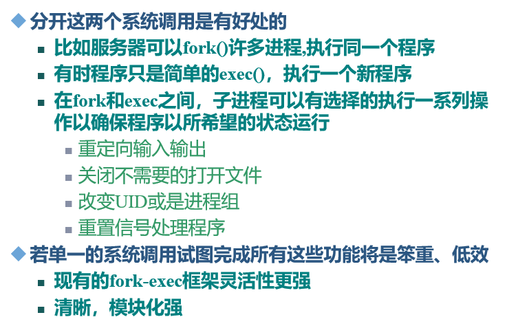

## Chap2 Linux进程管理
* 理解进程控制块tast_struct的作用，重要字段的含义
* Linux进程的状态类型？变化情况？建寺状态的进程如何处理？
* Linux 2.4进程的系统堆栈，Linux2.6进程的系统堆栈
* Linux进程间的家庭关系
* 进程组织所涉及到的数据结构（进程链表、运行队列、等待队列、pidhash表）的作用
* Linux的进程控制：相关函数的作用、执行过程
  * fork():sys_fork()/sys_clone()/vfork()的区别
  * exec()
  * wait()
  * exit()
* 什么是写时复制技术
* 结合do_fork()的源代码理解父进程创建子进程的过程

### 0. 进程与线程
* **进程**
  * 定义
    * **程序的一次执行**及其所**包含资源**的总称
  * 性质
    * 每个进程具有一定的**功能和权限**，运行在**独立的虚拟地址空间**中
    * 进程时系统**资源分配的基本单位**，CPU**调度的基本单位**
    * 用PCB表示
* **线程**
  * 进程中的活动对象
    * 有独立程序计数器，进程栈及一组进程寄存器
* 一个进程包含多个线程
* 进程是**资源分配**的基本单位；线程是**处理器调度**的独立单位
* 内存
  * 正文段、进程数据段、系统堆栈

### 1. Linux进程描述
* task_struct
  * 使用task_struct描述一个进程，代表一个进程的PCB
  * 定义于/include/linux/sched.h
  * task[NR_TASKS], NR_TASKS(系统可记录进程数) = 512


### 2. Linux进程状态与转换
* task_struct中的state表示进程当前状态
* **状态**：
  * TASK_RUNNING; TASK_INTERRUPTIBLE; TASK_UNINTERRUPTIBLE; TASK_STOPPED; TASK_TRACED; TASK_ZOMBIE; TASK_DEAD
  * **2.6相较2.4新增状态**：TASK_TRACED, TASK_DEAD
* **运行态/就绪态**
  * **TASK_RUNNING**：**正在运行或**已处于**就绪**只等待CPU调度
    * 由**current指针指向当前运行的进程**。
  * **TASK_TRACED**：供调试使用
* 被挂起态
  * **TASK_INTERRUPTIBLE**：**可**被信号或中断唤醒进入就绪队列
  * **TASK_UNINTERRUPTIBLE**：等待资源**不可**被其他进程中断
  * **TASK_STOPPED**：被调试暂停，或收到SIGSTOP等信号
* 不可运行态
  * **TASK_ZOMBIE**：**正在终止**(已结束，已释放内存、文件等资源，**但其父进程未接到通知，描述符未释放**)，**等待父进程通过wait4()或waitpid()回收**
  * **TASK_DEAD**：已退出且不需父进程回收的进程的状态
* 进程转换
  * 运行进程申请资源无效时：
      * **sleep_on()/sleep_on_timeout()**:TASK_RUNNING $\to$ TASK_**UN**INTERRUPTIBLE
    * 转到**UN**INTERRUPTIBLE一般是**硬件资源**，申请不到则执行不下去。**不能**由signal信号或时钟中断唤醒回到TASK_RUNNING状态
  * 申请资源或运行中出现某种错误时
    * **interruptible_sleep_on_timeout()**TASK_RUNNING $\to$ TASK_INTERRUPTIBLE
    * 系统**给进程一次重新运行**的机会。等待规定的时间片长度,再重新试一次。

<div STYLE="page-break-after: always;"></div>

  * wake_up()
    * TASK_INTERRUPTIBLE:进程资源有效时使用:wake_up(); wake_up_interruptible(); wake_up_process()唤醒
    * TASK_UNINTERRUPTIBLE:不能由signal信号或时钟中断唤醒,只能由wake_up(); wake_up_process()唤醒


### 3. Linux进程标识与组织
* pid
  * 功能
    * 用于**标识进程**
    * **pid与进程描述符一一对应**
  * 数据结构
    * pid_t是一个int数据类型:0~32767
  * 生成新pid:get_pid()。+1，循环
  * 获取进程pid:ps命令；getpid()-->sys_getpid()
* tgid 进程组标识
  * 功能
    * 进程是否属于同组
    * **组ID是第一个组内线程（父进程）的ID**
    * **线程组**中的**所有线程共享相同的PID**
      * **单线程**进程：**tgid和pid相等**
      * **多线程**进程：组内所有线程**tgid都相等=父进程pid**
* 用户相关进程标识符
  * 用户标识uid及组标识gid
  * 有效用户标识euid及有效组标识egid
  * 备份用户标识suid及备份组标识sgid
  * 文件系统标识fsuid及文件系统组标识fsgid
  * **通过getXXX()获取**


### 4. Linux进程的系统堆栈
* 每个进程都要**单独分配一个8KB大小的系统堆栈**，存放进程描述符task_struct和内核堆栈。
  * task_struct：8k低端(约1k大)
  * 内核堆栈：8k高端。进程处于内核态时使用
* 8192($2^{13}$)字节，占两个连续页框。第一个页框起始地址为$2^{13}$倍数
* 进程**个数限制**：
  * 所有进程的PCB及系统堆栈占用空间≤1/2的物理内存总和


  * 便于根据esp指针获取current指针(因为是$2^{13}$的倍数只需要将低13位清零)
  * `current = (struct task_struct(*)STACK_POINTE&0xFFFE000)`
* 进程描述符管理
  * 分配：alloc_task_struct()
  * 回收：free_task_struct()
  * 访问：get_task_struct()
* **Linux2.6**
  * 使用struct thread_info(约52Byte，其中的task成员指向task_struct)替换task_sturct
  * THREAD_SIZE根据内核配置可以是4k或8k大。从esp获取current时分别位12位和13位
<div STYLE="page-break-after: always;"></div>

  * 原因分析
    * PCB中最**频繁被引用**的是thread_info。
    * 进程的PCB中的内容越来越多，所需空间越来越大，使得留给内核堆栈的空间过小，所以将部分进程控制块移出这个空间，只在核心栈保留了访问频繁的thread_info.

### 5. Linux进程的链表结构
* 进程链表
  * 所有进程链表、运行队列、等待队列、pidhash表
* 所有进程链表
  * 通过*prev_task和*next_task组成一个**双向循环列表**，头和尾都是init_task，在运行中保持不变。
* 运行队列
  * TASK_RUNNING组成的**双向循环链表**，run_list开头
* pidhash表
  * 知道进程pid，可以通过哈希表快速找到进程。


* 等待队列
  * 由TASK_INTERRUPTIBLE和TASK_UNINTERRUPTIBLE组成
  * 等待队列的数据结构
```C
struct __wait_queue{
  unsigned int flags;
  struct task_struct *task;
  struct list_head task_list;
};
```
  * 互斥进程(flag=1)由内核有选择地唤醒
  * 非互斥进程(flag=0)总是由内核在事件发生时唤醒
* TASK_STOPPED和TASK_ZOMBIE进程通过pid或亲属关系检索

### 6. Linux进程的家族关系
* 所有进程**都是init进程(pid=1)的后代**
* 每个进程**必须有一个父进程**
* 每个进程**可以拥有零个或者多个子进程**
* 具有**相同父进程的进程称为兄弟**
* 进程间的父子关系采用树型组织
  * p_opptr : original parent  (1号进程或者创建它的父进程)
  * p_pptr: 父进程，有时候是调试时的调试监管进程
  * p_cptr: child (指向自己最年轻的子进程)
  * p_ysptr：指向比自己年轻的兄弟进程
  * p_osptr：指向比自己老的兄弟进程


  * 进程创建时**p_opptr和p_pptr是一致的**。在**运行中p_pptr可以暂时地改变**
  * 一个进程通过系统调用**ptrace()**来跟踪另一个进程时，**被跟踪**进程的**p_pptr指针指向正在跟踪它的进程**，跟踪进程暂时成为被跟踪进程的养父。
  * 一个进程在其子进程之前去世时。若当前进程是一个线程，p_opptr指向同一线程组的下一个线程。否则，p_opptr指向init进程，init进程相当于孤儿院。
* 0号进程
  * 是**所有进程的祖先**。在**OS启动时创建**。由他执行**cpu_idle()**函数。没有进程处于TASK_RUNNING时，调度0号进程
* 1号进程
  * init进程，由0号进程创建。
  * 首先创建一些后台进程来维护系统，然后进行系统配置，执行shell编写的初始化程序。然后转入用户态运行
* 获取父进程：current->parent
* 获取所有子进程(遍历子进程链表)

<div STYLE="page-break-after: always;"></div>

### 7. Linux进程控制
* 进程的创建、执行、等待、终止
* 0号进程
  * 维护Linux**内核代码段、数据段及堆栈**
  * 唯一一个通过**静态分配**创建的进程
  * start_kernel函数初始化内核所需所有数据结构、激活中断、创建1号内核线程
* 1号内核进程
  * 0号进程调用rest_init创建
  * 执行init()函数
    * 实现从内核态到用户态的切换
    * 为常规内核任务初始化一些必要内核线程:kflushd,kswapd
    * 调用系统调用execve()装入可执行程序init
* 传统UNIX系统中子进程复制父进程的所有资源
  * 创建过程慢、效率低，很多资源用不到
  * 改进：写时复制、sys_fork()sys_clone()/sys_vfork()、轻量级进程允许父子进程共享多个数据结构，阻塞父进程


* 写时复制
  * 父进程的资源被设置为**只读**，当父进程或子进程试图修改某些内容时，内核才在**修改前将该部分进行拷贝**
  * fork()
    * 只复制父进程的页表，通过页表项共享页面，页表项均标志为只读。
    * 为子进程创建唯一PCB
    * **逻辑拷贝**整个进程的地址空间，仅当**试图修改页面才真正的拷贝**
* 进程创建：sys_fork()/sys_clone()(轻量级线程)/sys_vfork()
  * 都调用同一内核函数do_fork()
> do_fork(unsigned long clone_flag, unsigned long stack_start, struct pt_regs *regs, unsigned long stack_size, int _user *parent_tidptr, int _user *child_tidptr)；

> clone_flag：子进程创建相关标志；stack_start：将用户态堆栈指针赋给子进程的esp；regs：指向通用寄存器值的指针；stack_size：未使用（总设为0）；parent_tidptr：父进程的用户态变量地址，若需父进程与新轻量级进程有相同PID，则需设置CLONE_PARENT_SETTID；child_tidptr：新轻量级进程的用户态变量地址，若需让新进程具有同类进程的PID ，需设置CLONE_CHILD_SETTID
* sys_fork()
  * 子进程**完全复制父进程的资源**
  * 子进程的**执行独立于父进程**
  * **专门的通信机制来实现进程间数据共享**
  * 父进程执行fork()返回子进程的PID值
  * 子进程执行fork()返回0
  * 调用失败返回-1
* sys_vfork()
  * 子进程与父进程**共享地址空间**
  * 子进程作为父进程的**一个单独线程在其地址空间运行**
  * 子进程从父进程继承控制终端、信号标志位、可访问的主存区、环境变量和其他资源分配
  * 子进程对虚拟空间任何数据的修改都可为父进程所见 
  * **父进程将被阻塞**，直到子进程调用execve()或exit()
  * 与fork()**功能相同**，**不拷贝父进程的页表项**
  * 子进程只执行exec()时，vfork()为首选
* clone()
  * 创建轻量级进程(LWP)的系统调用
  * 通过clone_flag控制
* sys_fork():**除了代码段**外，**父子进程不共享任何东西**（各自有一份）
* sys_clone():有**选择地对父进程进行复制**，可根据提供的clone_flags决定共享的内容
  * 不提供标志时sys_clone()与sys_fork()相同
* sys_vfork():在写时复制出现后基本不用
  * vfork()创建的新进程共享父进程的内存地址空间。通过复制指针的方法使子进程与父进程的资源实现共享。
  * **父进程在这个过程中被阻塞**，直到子进程退出或者通过exec()执行一个新的程序(租用父进程的地址空间)。因此，sys_vfork()保证子进程先运行，在它调用exec()或exit之后父进程才可能被调度运行.  可以理解为：**vfork创建新进程的目的是exec()一个新进程**。
* 多数情况，子进程从fork()返回后调用exec()函数来执行新的程序
  * exec，新程序替代程序段，从main()开始执行
  * exec不创建新进程，前后进程ID不变，但用另外一个程序替代当前进程的正文、数据、堆栈等



* 创建子进程后
  1. 父进程不理睬子进程，继续执行。如果子进程先于父进程消亡的话，则内核会发送一个信号，通知父进程。
  2. 父进程暂停，睡眠，等待子进程结束后继续运行
  3. 父进程自行结束，使用exit()
* wait()
  * 父进程调用检查子进程是否终止
  * 父进程调用wait()后进入阻塞队列中。子进程结束时会产生一个终止状态字，系统内核再向父进程发出SIGCHILD信号。当接收到信号时，父进程提取子进程的终止状态字，从wait()返回到原程序。
* wait()作用
  * 获取子进程终止的消息
  * 清除子进程的所有独占资源


* 撤销时机
  * 主动撤销：执行完代码，通知内核释放进程的资源
  * 被动撤消：内核强迫杀死进程
    * 进程接收到一个不能处理或忽视的信号
    * 在内核态产生一个不可恢复的CPU异常，而内核此时正代表该进程在运行
* 撤消相关进程状态
  * 进程已死，但必须保存它的描述符，在得到通知后才可以删除
  * 僵死状态，表明进程已死，但需要等待父进程删除（如通过wait()）

* exit相关
  * 进程退出
    * 释放进程占有的大部分资源
    * 信号机制
  * 进程删除 
    * **彻底删除**进程的**所有数据结构**
    * 父进程调用wait()类系统调用**获知子进程合法终止后**，即**可删除**该进程。
  * exit()，_exit()
    * 正常结束时返回0，否则表示出错信息
    * 都通过do_exit()调用
    * _exit()直接使进程停止工作，做清除和销毁工作
    * exit()在调用do_exit()系统调用前检查文件打开情况，清理I/O缓冲
  * 进程**终止时要做的事**
    * 通知父进程自己将要终止，通常利用**信号通知机制**，**可以通过exit函数实现**
    * 父进程要有**相应的机制响应子进程的终止信号**。通过**信号处理程序**和**wait4()**函数实现
    * 当父进程在子进程前终止时，要为其找一个父进程，如init进程
  * 终止步骤
    1. 自己调用函数**exit()**将自己的状态变为**僵死状态**，而后向父进程**发送终止信号**。
    2. 由父进程调用**wait()函数**，**回收僵死状态的子进程**，将其从内存中**彻底清除**。 
  * 终止方法
    * exit()系统调用
    * 内核强迫进程终止

### 8. Linux进程与线程实现
* Linux的线程描述机制
  * **其他多线程OS**用两种数据结构描述进程与线程
  * Linux从**内核角度没有线程**，所有线程通过进程实现
  * 线程：与其他进程共享某些资源的进程，**有自己的进程描述符task_struct**
  * 内核**没有针对线程的调度算法或数据结构**


* Linux的线程分类
  * **用户线程**
    * 存在于用户空间中，通过**线程库**来实现
    * 线程创建和调度都**在用户空间进行**，**以进程为单位调度**
    * **特点**：
      * **同一进程内的线程切换不需要转换到内核**
      * 系统调度阻塞问题(一个线程阻塞则整个进程阻塞)，不能充分利用多处理器

  * **内核线程**
    * 在内核空间内执行线程的创建、调度和管理，**慢于用户线程**的创建和管理
      * 支持多处理器，支持用户进程中的多线程、内核线程切换的速度快
      * 对用户的线程切换来说，系统开销大
    * 独立运行在内核空间的标准进程，支持内核在后台执行一些操作
      * 刷新磁盘高速缓存；交换出不用的页框；维护网络链接等待
<div STYLE="page-break-after: always;"></div>

* Linux**线程的创建**
  * clone()：创建内核支持的用户线程，对内核可见且由内核调度
  * pthread_create()：由基于POSIX标准的线程库创建的用户线程
    * 但在**Linux里， pthread_create()最终调用clone()实现**
