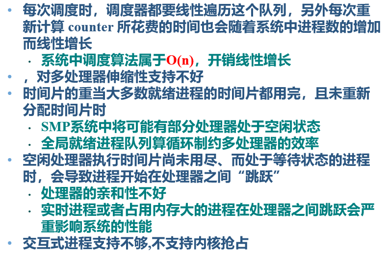
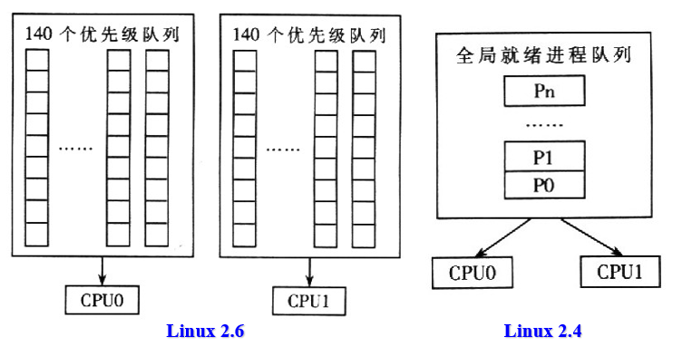
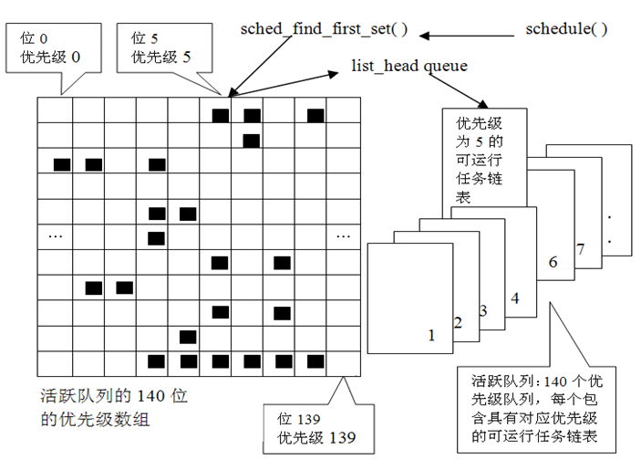
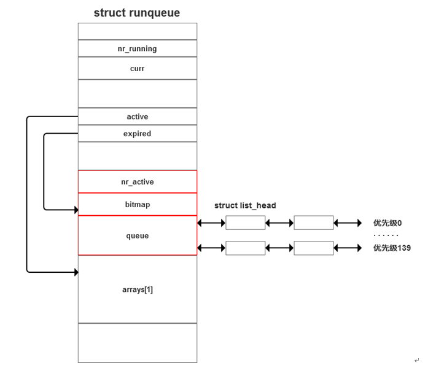

## Chap3 Linux进程调度
* Linux的进程调度方式有哪些？
* 静态优先级、动态优先级、counter的作用
* 普通进程和实时进程调度
* Linux的三种调度策略
* do_fork()中的父子进程的优先级，时间片的设置有什么特点
* 调度时机有哪些，都是如何实现的
* 调度时优先级的重新计算方法，计算时间
* Linux2.6进程调度特征分析，与Linux2.4的区别
2.4 O(n), 2.6 O(1)

### 1. Linux进程调度策略
* 基于分时技术的抢占式调度：依赖于**时钟中断**，**对进程透明**。
* 调度策略：一组规则，决定什么时候以怎样的方式选择一个新进程运行
  * 进程**分类**：**普通**进程，**实时**进程
    * 实时进程优于普通进程。优先级**远大于**普通进程
    * **普通进程**
      * 动态优先级调度，计算得来，周期性修改(避免饥饿)
      * SCHED_OTHER：时间片用于表示一个进程在被抢占前可以运行的时间。
    * **实时进程**
      * 静态优先级调度，由**用户预先指定**，**只能**由用户通过sys_setpriority()修改。
      * SCHED_FIFO:先进先出，除非有更紧急优先级更高的实时进程抢占。
      * SCHED_RR
  * **优先级**：**静态**优先级，**动态**优先级。
    * 计算得到，动态变化
      * 较长时间未分配到CPU的进程，优先级++
      * 已在CPU上运行了较长时间的进程，优先级--
  * 用户通过sched_setscheduler()改变自己的调度策略。
  * 调度器从**就绪态进程链表**中找出最合适的进程投入运行
* **基本思想**
  * 根据**进程价值**及**CPU时间需求**对进程分级。
    * 相同优先级按RR或FIFO调度。
* Linux实现
  * 基于动态优先级的调度算法
    * 设置基本优先级，根据需要动态调整优先级
  * 两组**独立的优先级范围**
    * **nice**（-20~19）：确定分配给进程的时间片大小
    * **rt_priority**（0~99）：**实时优先级**，实时进程的优先级高于普通进程
  * **静态优先级：priority**
    * 表示**分配给进程的时间片**
    * 指明在被迫和其他进程竞争CPU之前，**进程允许的最大时间片**
    * 只能由**用户进行修改**，**不随时间而改变**，**通过nice设定**
  * **动态优先级：counter**
    * 进程**拥有CPU时随时间不断减小**
    * 指明在**这个时间片**中所**剩余的时间量**
    * 当**小于0时，标记进程重新调度**
  * **实时优先级：rt_priority**
    * 确定实时进程的调度顺序，较高权值进程优先于较低权值进程
    * **非实时进程的优先级为0**，因此实时进程总优先于非实时进程
* **普通进程**
  * **动态**优先级
    * **更新counter**值，周期性修改进程优先级（避免饥饿）
  * 基本**过程**
    * counter变为0时，用**priority对counter重新赋值**
    * **所有**可运行状态进程的时间片**都用完后**才对counter重新赋值
    * 进程运行过程中，counter的减小为其它进程提供运行机会
    * 该机制相当于优先级在动态变化，所以称之为动态优先调度 
* **实时进程**
  * 静态优先级策略
    * **counter只表示剩余时间片**
    * **不作为衡量其是否值得运行的标准**（与普通进程的区别）
* **动态调整**优先级及时间片长度
  * **提高交互式程序的优先级**，使其运行得更频繁
  * 调度程序为**交互式程序**提供**较长的默认时间片**
  * 进程不一定要一次性使用完所有的**时间片，可以分批使用**，从而确保**尽可能长时间地处于可运行状态**
  * **没有时间片**的进程**不会再投入运行**，除非等到其他**所有进程都耗尽其时间片**
* 策略分类
  * 实时进程：SCHED_FIFO, SCHED_RR
  * 普通进程：SCHED_OTHER
  * SCHED_YIELD：主动放弃CPU

### 2. Linux进程调度依据
* 基本思想：选择**weight最大的进程**
* 权值计算：**goodness()**
  * 每次执行schedule()时都要调用该函数
  * **不返回负值**
  * 普通进程
    * 与**policy, priority, counter, nice**等相关
    * weight = p->counter
    * **goodness()返回值<=1000**
    * 进程当前时间片内所剩的**tick**数
      * 代表进程优先级，反映进程的“欠运行程度”
    * 进程**上次是否在当前CPU上运行**
      * 若是，权值增加一个常量（weight += PROC_CHANGE_PENALTY）
    * 切换**是否需要切换内存**
      * 若不需要，则权值加1(weight += 1)
    * 用户**可控优先级nice**
      * nice越小则权值越大(**weight += 20 - p->nice**)
  * 实时进程
    * 与**policy, rt_priority**等相关
    * weight = 1000 + rt_priority
      * 基准值1000使实时进程权值比所有非实时进程都要大
    * **goodness()返回值>1000。1001~1099**
    * 权值大小**仅由rt_priority值决定**
    * 只要就绪队列**存在实时进程**，调度器都将优先满足
* 调度器将CPU时间划分为**时期epoch**
  * 在**一个时期内**，每个进程**分配一个指定时间片**。
    * 一个进程**用完其时间片时**，将会**被强占**
    * 只要进程的时间片没有用完，就可以被多次调度运行
  * 所有进程的时间片用完后，时期才结束
  * 此时重新计算所有进程时间片，开始一个新时期
* Linux时间单位:**tick(10ms)**
  * 时间片指时间滴答数
  * >priority = 20, 时间片 = 20*10 = 200ms
* 时间片长短
  * **尽量长，同时保持好的响应性**
  * **太短**
    * 频繁切换系统开销过大
  * **太长**
    * 几乎每个进程都一次性执行完，基本没有并发
    * 系统对**交互的响应表现欠佳**
    * **普通进程要等待很长时间**
* 为**非SCHED_FIFO**调度策略的每个进程提供一个**运行时间配额counter**
  * 表示**剩余时间片**
  * **counter初值与nice值有关**
  * **tick中断发生counter-1**，直到为0
  * 新时期开始后重新计算
  * **子进程继承父进程的一半剩余时间片**
    * child.counter = (parent.counter+1)/2
    * 父进程也减半
    * 子进程结束后，剩余时间篇归还父进程，以免父进程因创建子进程而遭受时间片的损失 
* 更新函数update_process_times()
  * SCHED_RR
    * counter降到0，从runqueue中当前位置移到队尾，恢复最初时间配额。
  * SCHED_OTHER
    * 所有就绪进程counter降到为0时，重新计算并设置每个进程的时间配额
* **所有就绪进程**的**动态优先级都为0**时，**重新计算进程的动态优先级**，包括**就绪态进程+等待态进程**。
  * **计算方法**：新动态优先级 = 旧动态优先级右移一位，加上该动态的静态优先级
  * 基本时间片的值**通常为6**，由于时钟中断大约10ms左右，因此**基本时间片的长度大约60ms**

  * **就绪态进程**:由于其动态优先级都为0，**计算结果为nice值**。
  * **等待态进程**:此时它们的**动态优先级都不为0**，计算结果**等待态进程的动态优先级会大于静态优先级**，但决**不会比静态优先级两倍更大**。
  * **等待态**进程会有**较高的优先级**，处于**等待态越久的进程，其进程的动态优先级会越高**
  * 因此，**I/O较多**的进程由于其等待时间久，会有**较高的优先级**(**linux偏向I/O密集型进程**)；**计算较多**的进程因其占用CPU 多使**优先级会较低**。

### 3. Linux进程调度时机
* **主动调度**：当前进程**所需资源无法满足而必须立即阻塞**时，直接调用schedule() 
  1. 将current插入到合适的等待队列中
  2. 状态改变为TASK_INTERRUPTIBLE或TASK_UNINTERRUPTIBLE
  3. 调用schedule()
  4. 检查所需资源是否可用
      * 若不可用，转到第2 步
  5. 一旦所需资源可用，将current从等待队列中删除

* **被动调度**：将当前进程的**need_resched设为1**，从而请求调度
  * 时机：
    * 当前进程**用完CPU时间片时**
    * 一个**进程被唤醒，且优先级高于当前进程时**
    * 调用sched_setscheduler()或sched_ yield()系统调用时
    * 每次**进入用户态进程前**
    * 系统调用执行结束，控制由核心态返回用户态前
* schedule()的主要工作
  1. **选择进程**：当**CPU空闲时**，调度子程序**扫描运行队列所有活动进程**，选择一个合适进程运行：
     1. 如果执行队列中**有实时进程**，则**选择一个优先级最高**（goodness（）计算的值最大）的进程（可保证实时进程总比普通进程优先执行）
     2. 如果运行队列中的**进程有相同优先级**，**则耗时多**(counter值较大)的进程比耗时少的进程**优先调度**。
     3. 如果**优先级相同且counter 值也相等**，则**位于队列前面的进程被优先调度**。
  2. **切换进程**：当CPU从运行队列中选中一个合适的进程后，就按照task_struct 结构中的信息进行进程上下文切换；
     1. 首先把当前进程放到适当的等待队列里
     2. 把当前进程的状态设为TASK_INTERRUPTIBLE或者TASK_UNINTERRUPTIBLE
     3. 调用schedule()，让新的进程运行

### 4. Linux进程调度实现
* 通过sched.c文件完成
  * 进程的选择和进程的切换
    * 遍历进程队列，找到优先级最高的
* switch_to()
  * 将esi，edi，ebp压入堆栈
  * 堆栈指针esp保存到prev->thread.esp
  * 将esp恢复为next->thread.esp
  * 将标号1:的地址保存到prev->thread.eip
  * 将next->eip压入堆栈
  * 无条件跳转到__switch_to()函数
  * switch_to()中jmp指令以后代码（标号1:的代码)
* 全局共享队列：runqueue
* 进程优先级
  * 静态优先级：priority
    * 可通过nice调整，决定进程的初始时间片
  * 实时优先级： rt_priority
    * 只对实时进程有效
  * 动态优先级：通过goodness()完成，决定进程调度顺序
    * 动态优先级在goodness()中集中式完成

### 5. Linux2.4进程调度分析
* **没有根据进程的调度策略分别管理进程**，把所有可运行进程都集中于同一个队列中，**三种调度算法在实现过程中合为一种，使用同一段程序**。
* 查找最佳候选就绪进程的过程是在调度器schedule()中进行的，每一次调度都要进行一次（在for循环中调用goodness()），所有就绪进程的时间片都耗完后在调度器中一次性重算。查找过程与当前就绪进程的个数相关，**时间复杂度是O(n)级**
* 调度动作的**执行时间**就和当前**系统负载相关**，无法给定一个上限，这**与实时性的要求相违背**。

### 6. Linux2.6进程调度特带你
#### 优化目标
* 提供完全O(1)调度算法
  * 不管系统有多少进程，调度算法都必须在常数时间内完成调度
* 对SMP有良好可伸缩性
  * 每个处理器应有独立的可执行进程队列和锁机制
* 提高SMP处理器的亲和性
  * 出现负载不均衡时，应具备在处理器间迁移进程的能力

* **基于每个CPU分配时间片**，**取消全局同步和重算循环**
* 每个处理器有**两个数组**：**活动就绪进程队列**和**不活跃就绪**进程队列
  * **消耗完其“时间片”后**，进入**不活跃就绪进程数组中相应队列的队尾**
  * 当所有进程都“耗尽”其“时间片”后，**交换活跃与不活跃就绪进程队列**数组
* 每个数组中有140个就绪进程队列(runqueue)，每个队列对应于140个优先级的一个
  * 通过位图标记队列状态
  * 调度时，通过find_first_bit()**找到第一个非空的队列**，并取队首进程
  * **不管队列中有多少就绪进程，挑选就绪程的速度恒定，因此称为O(1)算法**

* active & expired
  * active：时间片**没有用完**，**当前可被调度**的就绪进程
  * expired：时间片**已用完**的就绪进程
* arrays是两类就绪队列的容器，active 和 expired 分别指向其中一个
  * active中的进程一旦用完自身时间片，就被转移到 expired中，**并重新设置新的初始时间片**
  * active为空时，表示当前所有进程的时间片都消耗完
    * active 和 expired **对调**，重新开始下一轮的时间片递减过程
* **实时进程的优先级为0～99,普通进程的优先级为100～139**

* 交换时机
  * active数组的**可执行队列上的进程为空**
* **时间片计算时机**
  * 进程由active数组移至expired数组之前

#### 特点
* 每个处理器都**有独立就绪进程队列**
* 各处理器可**并行运行调度程序**
* 不同处理器上的**进程可以完全并行地休眠、唤醒和上下文切换**
* **进程只映射到一个处理器的就绪进程队列中**
  * **不会被其他处理器选中**
  * **不会在不同处理器之间跳跃**

#### 对比
* Linux 2.4的调度算法
  * 需要遍历可运行队列，**算法O(n)**
  * Epoch，基本时间片，动态优先级
* Linux 2.6.17的调度算法（2.6.23之前）
  * 采用双队列（Active；expire ），按照优先级组队，**O(1)**
* Linux 2.6.26的调度算法
  * 非实时：CFS，vruntime，红黑树
  * 实时：优先级队列

* Linux进程可以指定该进程所采用的调度策略
* 调度算法根据进程的调度策略，采用不同的调度算法

* time_slice
  * 2.6 中，time_slice 变量代替了 2.4 中的 counter 变量来表示进程剩余运行时间片，但不再直接影响进程的动态优先级。

