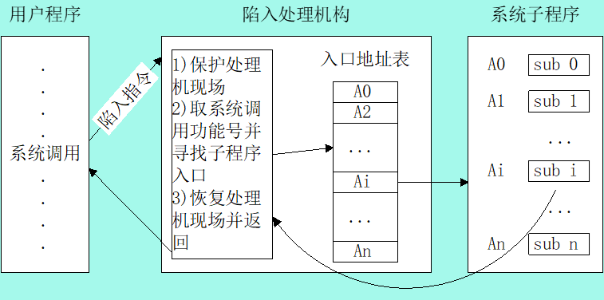
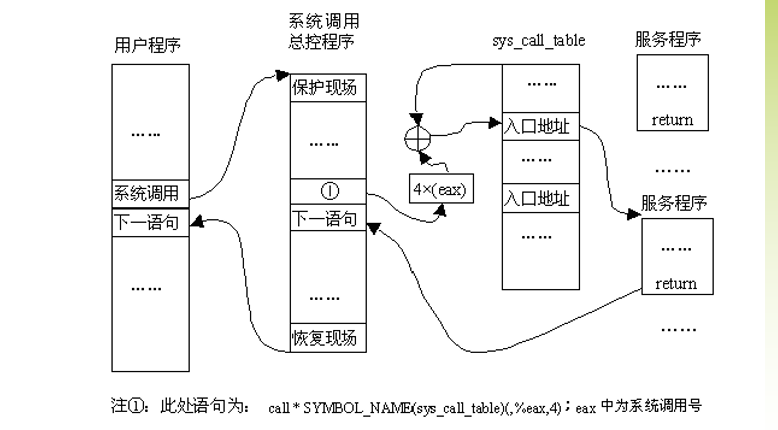

## Chap4 系统调用与中断
* 什么是系统调用？为什么要引入系统调用
* INT 0X80指令的作用
* 结合system_call理解系统调用的整个执行过程
* 系统调用表的组织结构？系统调用号的作用
* 系统调用的参数传递方法
* **不要求**：
  * 描述一个添加系统调用的步骤。

### 4.1 Linux系统调用功能
* 系统调用：对**OS内核中一组实现系统功能的过程的调用**。
  * 一般情况下进程不能存取系统内核
  * **用户态进入内核态的唯一入口**

* `int $0x80`：用户态$\to$内核态，控制权交给系统调用过程起点
  * i386体系软件中断，产生**向量为128的编程异常**
  * CPU切换到内核态，转到系统调用处理程序入口:system_call()
* system_call()
  1. 检查系统**调用号**，该号码告诉内核进程请求哪种服务。
  2. 内核进程查看系统**调用表**(sys_call_table),找到所调用的内核函数**入口地址**
  3. 接着**调用相应的函数**，在返回后做一些系统检查，最后返回到进程
* 系统命令
  * 系统命令相对API来说，更高一层。每个系统命令都是一个执行程序。这些**命令的实现调用了系统调用**。

### 4.2 Linux系统调用处理过程
#### system_call()执行过程
1. 将系统调用号(eax)和可以用到的所有CPU寄存器保存到相应的堆栈中（由SAVE_ALL完成）；
2. 对系统调用号进行有效性检查(应该小于 NR_syscalls）
3. 若为合法系统调用，再**进一步检测该系统调用是否正被跟踪**；
4. 根据eax中的系统调用号**调用相应的服务例程**。
5. 服务例程**结束后**，从**eax寄存器获得其返回值**，并把这个返回值存**放在堆栈中**，**让其位于用户态eax寄存器曾存放位置**。
6. 然后**跳转到ret_from_sys_call()**，终止系统调用程序的执行。

#### SAVE_ALL
* 将寄存器中的参数压入到核心栈中(让内核能使用用户传入的参数)
* INT不自动拷贝参数，因此需要SAVE_ALL。

#### 系统调用表与系统调用号
* 为**每个系统调用定义了一个唯一的编号**，定义在linux/include/asm/unistd.h中（最大为**NR_syscall = 256**）
* 内核中保留一个系统调用表，保存了调用编号与对应服务例程地址
* 系统调用陷入内陷前，需要把系统调用号一起传入内核
* 在执行int $0x80前把调用号装入eax寄存器
* 系统调用表：arch/i386/kernel/entry.s
  * 系统调用号为偏移量找到对应表项
  * sys_call_table基地址+eax*4 = 表项地址

#### 系统调用返回
1. 服务例程结束，system_call()从eax急促请你获得系统调用返回值，**放在曾保存用户态eax寄存器栈单元上**
2. 跳转到ret_from_sys_call( )，终止系统调用处理程序的执行。
3. RESTORE_ALL恢复用户进入内核前被保留到堆栈中的寄存器值，eax中为系统调用返回值

#### 系统调用返回值
* \>=0表示系统调用成功结束
* 负数表示出错条件
* 与封装例程返回值的约定不同

### 4.3 Linux系统调用的参数传递
* 因为系统调用由用户态进入内核态，既不能使用用户态的堆栈也不能直接使用内核态的堆栈
1. 在int $0x80前将参数写入CPU寄存器，进入内核态后拷入内核态堆栈
   1. 参数长度不能超过寄存器长度
   2. 主要参数：调用号，调用所需参数
   3. 调用号与返回值:eax；系统调用参数：ebx, ecx, edx, esi和edi中
2. 当参数超过6个时，**使用ebx指向存放参数的连续的内存区**

### 4.4 Linux中如何增加一个系统调用
1. 添加系统调用号：它位于unistd.h，每个系统调用号都以“_NR_开头”
2. 在系统调用表中添加相应的表项
3. 实现系统调用服务例程
4. 重新编译内核，启动新内核
5. 编写一段测试程序检验实验结果
