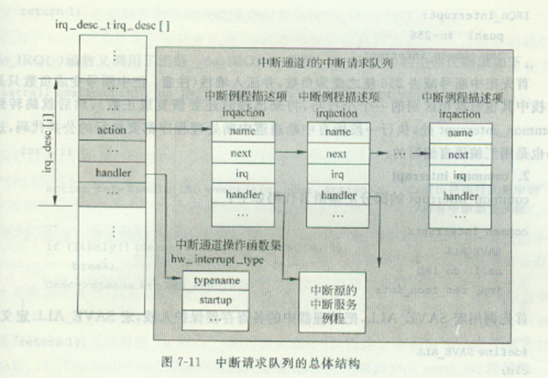
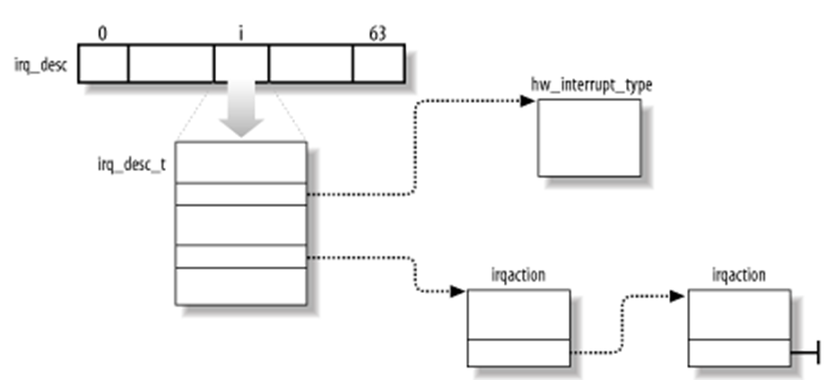
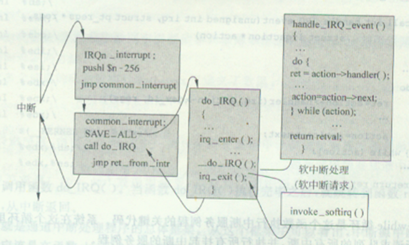
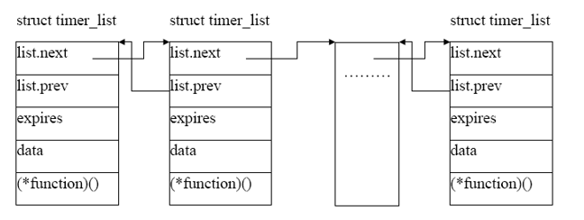
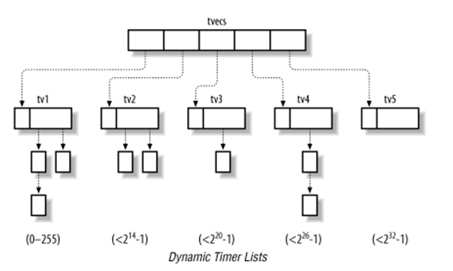
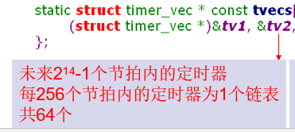

## Chap5 Linux中断处理
* 什么是快中断？什么是慢中断？为什么要进行区分？各自的特点是什么？
* 为什么要引入下半部？下半部的组织？
* 发生时中断时，上、下部分如何处理
* 定时器中断的定义及其相关数据结构
* 动态定时器是如何迁移的。

### 5.1 快中断与慢中断
* 相应中断时需要关中断，直到中断处理程序中调用开中断STI
* 如果中断处理时间过长会导致失去对其他中断的响应能力（出现死机）
* 开中断时间太长，也会造成中断不断进行
* 折中办法：快中断与慢中断/上半部与下半部
#### 快与慢
* 快中断：简单、时间短
  * 一般发生较频繁
  * 保存**部分被修改的寄存器**
  * 关中断
  * 处理完后恢复现场继续执行
* 慢中断：复杂、时间长
  * 保存**所有寄存器**
  * 开中断
  * 处理完后通常不返回被中断进程，直接重新调度

#### 上半部&下半部
* 将执行时间可能比较长的中断处理程序一分为二，称作top half和bottom half
* top_half(上半部)：**重要**的、与**硬件设备紧密相关**的程序，这些程序一定要**关中断**执行。
  * 将上半部看做是一个用来实现“**登记中断**”功能的函数。中断发生时，把中断例程的下半部分挂接到该设备的下半部分执行队列中
* bottom_half(下半部)：其余的一些处理程序，这些程序**不怕被中断**，**可以稍后执行**
* **执行过程**：
  * **上半部分立即执行**，将待处理的数据存**放到**一个设备**指定的缓冲区**，然后**标记它的下半部**再退出。
  * **由上半部决定下半部是否需要执行**
* 通过中断注册函数request_irq()传递参数irqflags来标识SA_Interrupt=1(快速)2(慢速)

### 5.2 关键数据结构
* irqaction:处理中断的相关信息
* irq_desc_t/irq_desc:中断请求队列数组
* hw_interrupt_type:描述中断控制器

#### 中断请求队列结构
* 为每个中断通道设置一个中断请求队列
  * 同一个通道的中断请求的irqaction组织在一个链表中，实现了irq的共享。
* irqaction[]指向设备的中断响应函数
  * handler指向具体的中断服务程序的入口

#### 结构体iqr_desc_t
* 中断描述数组iqr_desc[NR_IRQS]，每一个中断向量都与它的一个元素相关联，对应一个中断源：

#### hw_interrupt_type数据结构
* 是一个抽象的中断控制器描述
* 该结构中的域都是**函数指针**，它们指向了一些用来操作中断服务例程的**函数**，采用的是**面向对象的方法**。 

### 5.3 中断的注册与安装
* 中断源申请中断前，对应的中断服务例程必须已安装在通道的中断请求队列中
1. 使用request_irq()注册，以向系统申请一个**中断描述符空间**和一个**中断号**
2. 调用setup_irq()安装到中断请求队列，为中断服务分配一个irqaction。把handler指向中断服务例程
3. free_irq()将已经使用完的IRQ线释放掉，以便供其它设备使用。

#### 与中断处理相关的主要函数
* Init_ISA_irqs()
  * 负责初始化数组irq_desc[]
* Init_IRQ()
  * 初始化IDT中与硬件中断相对应的那些表项。
* do_IRQ()：该函数负责处理所有的外部设备中断

#### 过程
* 调用do_IRQ()之前，要为中断处理程序保存寄存器：SAVE_ALL
* do_IRQ的末尾，调用**iqr_exit()启动中断的下半部分**(invoke_softirq()//启动软中断)

#### 下半部机制实现
* 下半部可以通过多种机制实现
* 2.4开始引入
  * 软中断，Tasklet，工作队列
* 2.6中去除
  * BH，任务队列

### 5.4 定时器中断
#### Linux时间系统
* 根据系统启动后的时钟滴答数（节拍）来计算时间。
* **Jiffies**：用于存放自系统启动以来产生的总的节拍数。中断中由**上半部完成**
* Linux时钟每一个节拍到来时都会**引发一次中断**，每次中断后
  * 更新系统自启动以来所经过的时间
  * 更新时间和日期
  * 确定进程运行了多久
  * 检查每个定时器是否已经到期

#### 时钟中断处理例程
* 定时器中断(IRQ0) 
  * 上半部函数：timer_interrupt()。
    * 调用do_timer_interrupt()
    * 调用do_timer()，jiffies+1，标记需要运行的下半部
  * 下半部函数：timer_bh()
    * 更新有关时间计数值

### 5.5 定时器向量
#### 内核定时器
* 内核定时器**由数据结构timer_list表示**，该结构表示了一个待处理的延迟任务。  
  * 初始化时设置一个**相对于当前时刻**的**超时时间**和**超时处理函数**，将其插入到内核定时器队列中即可
* 定时器**向量**：**双向循环**定时器链表，其中**每个元素都是一个timer_list结构**，队列中的所有定时器都**在同一个时刻到期**

### 5.6 动态内核定时器
#### 动态定时器的提出
* 定时器的expires的值与jiffies的差值决定了一个定时器在多长时间后到期。在32位的系统中为0xffffffff。内核至少要维护0xffffffff个timer_list的队列。**数量太大**！
* 内核**仅关心那些当前已经到期或者马上就要到期**的定时器。
* interval = expires－jiffies
* 0≤interval≤255的定时器按照各自不同的expires值组织成256个定时器向量。
* 256≤interval≤0xffffffff的定时器按一种扩展的定时器向量语义进行组织。
  * 各定时器的expires值可以互不相同的一个定时器队列。 

#### tv1
* 全局变量，数据结构：timer_vec_root
* 表示前256个定时器向量
* tv1.vec[index]中包含了**当前时钟节拍内已经到期**的所有动态定时器。
* 当index值又重新变为0时，就意味着内核已经扫描了tv1变量中的所有256个定时器向量。在这种情况下就必须将那些以松散定时器向量语义来组织的定时器向量补充到tv1中来。 

#### tv2~5
* interval值在［0xff，0xffffffff］之间的定时器，具**有相同值的定时器**都将被组织在同一个松散定时器向量中。

