## Chap6 内存管理
* 实模式、保护模式，如何进行模式切换(CRO的PE位)
* 如何启用分页机制(CRO的PG位)
* 段描述符的作用、组成
* 段选择符的作用、组成
* 保护模式下的地址转换过程
* 内核空间和用户空间
* 为什么采用三级分页模式
* 掌握虚拟地址空间和物理地址空间的管理方法
* Linux用户地址空间的分布
  * 为什么要划分一个个区VMA？VMA的查找、删除?
  * mm_struct， vm_area_struct的作用？
  * 描述task_struct,vm_area_struct、mm_struct、页目录表、物理内存之间的关系（结合图）
* Linux如何实现请求页
* 物理地址空间的页面的分配
  * 伙伴算法
  * free_area[],bitmap的作用
  * 结合free_area[],bitmap理解基于伙伴算法的物理页面的分配和回收，并能够会应用。
* 缺页异常处理过程
  * Do_page_fault()、handle_mm_fault(),handle_pte_fault()的作用
* Slab分配器的作用
* 掌握地址的变换。

* **地址变化**
* **伙伴系统**

### 1. Linux内存寻址
#### i386中的段寄存器
* 6个段寄存器，每个寄存器16位
* 保护模式下，16位的寄存器无法存放32位段基地址。段寄存器中存放的不是基地址，是段选择子
  * 段基地址存放在段描述符表中

#### i386中的状态和控制寄存器 
* 标志寄存器EFLAGS、指令指针EIP、机器状态字CR0、Intel保留CR1、页故障地址CR2、页目录地址CR3
* CR0控制寄存器
  * 机器状态字
    * PE(Protected Enable)用于启动保护模式、
      * 1保护模式；0实模式
    * PG(Paging Enable)分页允许位

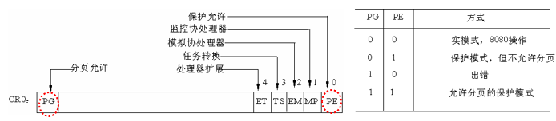
* CR3页目录基地址寄存器
  * **保存页目录表的物理地址**，页目录表**总是放在以4K字节为单位的存储器边界上**——**低12位为0**
#### i386中的系统地址寄存器 
* **全局描述符表寄存器GDTR**
  * 48位寄存器，保存GDT的32位基地址和16位GDT的界限
* **局部描述符表寄存器LDTR**
  * 16位寄存器，保存局部描述符表LDT段的选择子

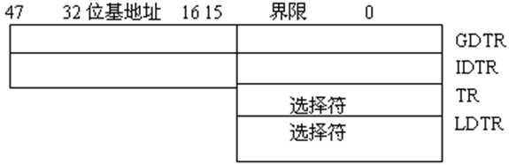
* CPU-(虚拟地址)->MMU(内存管理单元)-(物理地址)->存储器

#### 内存地址
* **逻辑地址**：每个逻辑地址由一个段(segment)和偏移量(offset)组成
* **线性地址**：32位无符号整数，可以表示**4G的地址空间**
* **物理地址**：用于芯片级内存单元寻址，与从CPU的地址引脚发送到内存总线上的电信号相对应
* **转换过程**
  * 逻辑地址-(分段单元)->线性地址-(分页单元)->物理地址

#### 段机制
* 段基址，界限，段属性

#### 段描述符
* 每个段由一个8个字节的段描述符来表示
  * 指出段的32位基地址(base字段)和20位段界限(limit字段) 
  * 第6个字节
    * G位：段界限粒度位，只对段界限有效
      * 当G=0时，表示段格式以字节长度
      * 当G=1时，表示段格式以4K字节为单位
    * D位：特殊位
  * 第5字节的第4位为0，说明是**系统段描述符**。

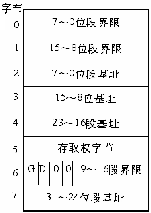

#### 段描述符表
* 定义i386所有段的情况，**描述符表占据一个字节为8的倍数的存储器空间**
* **全局描述符表GDT** (Global Description Table)
  
  * 除任务门、中断门和陷阱门描述符外，**包含着系统中所有任务共用段的描述符**
  * 存放**在RAM中**，使用一个专门的**寄存器GDTR指示GDT表在RAM中的位置**（物理起始地址）

* **局部描述符表LDT**（Local Description Table）
  * 包含**与给定任务有关的描述符** 
  * 存放**在RAM中**，使用LDTR来指示当前的LDT表
* **通常只定义一个GDT**，进程可根据需要创建附加的LDT

#### Intel CPU地址转换
* **实模式**(20位)
  * **16位段寄存器**只**记录段基址的高16位**，低4位全0，**必须4位对齐**
  * 不采用虚拟地址空间，**直接采用物理地址**空间
  * **物理地址=段寄存器值*16+段内偏移**
* **保护模式**(32位)
  * 配合**全局描述符表GDT**使用
  * GDT中记录了每个段的信息（段描述符），**段寄存器只需记录段在GDT中的序号**
  * **线性地址=段基地址+段内偏移**
  * **物理地址**：根据页表对线性地址进行转换而得到

#### 硬件中的分段
* I386体系结构采用**基于段选择子**的分段机制
* 逻辑地址=段：段内偏移
  * 段标识符：16位长，称为**段选择子**
  * 段内偏移：32位长
* 使用16位段寄存器来指明当前所使用的段
  * **索引号**:13位，**指定GDT表中的相应的段描述符**
  * **TI** (Table Indicator):1位，指明段描述符在 **GDT(TI=0)或LDT(TI=1)**中。
  * **RPL**(Request Privilege Level):2位，当相应段选择符装入到CS寄存器中时，指明CPU的当前特权级（用户/内核）

#### 段描述符的快速访问
* 16位段寄存器与GDT/LDT配合，对相应段寻址
* 在段选择子被装入段寄存器时，将相应的段描述符装入到对应的非编程寄存器，避免对GDT/LDT的访问

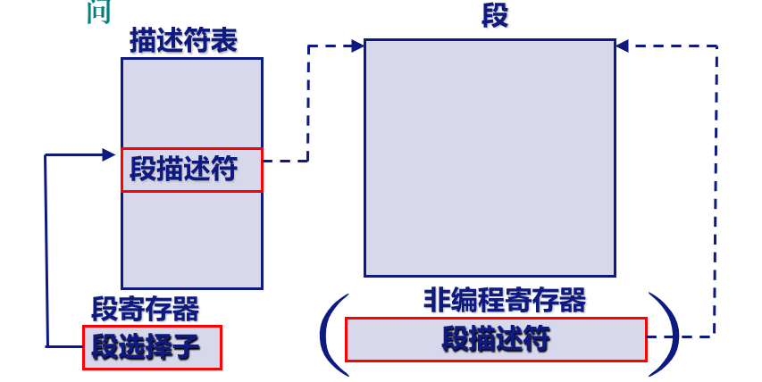

#### 逻辑地址到线性地址的转换
* 检查TI确定段描述符位置
* 从段选择子的index字段计算段描述符的地址
* 将逻辑地址的偏移量与段描述符base字段的值相加，得到线性地址

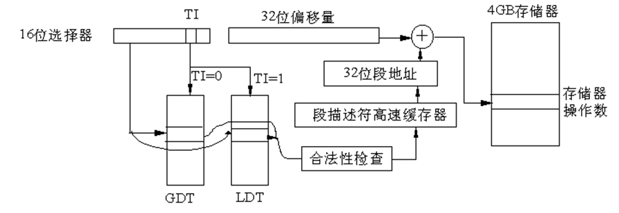

#### 硬件中的分页
* 分页单元(paging unit)
* 功能：线性地址$\to$物理地址
* 页(page):将线性地址分成以固定长度为单位的组
* 页表(page table)
  * 将线性地址映射到物理地址的数据结构
  * 存放在内存中，并在启用分页单元以前由内核对之进行初始化
* 页框(page frame)
  * 把所有RAM划分成以固定长度为单位的组
  * 每个页框可以包含一页，即页框长度等于页的长度
* 当PG=1时，启用分页;PG=0时，**线性地址被解释成物理地址**

#### 常规分页
* 一个页4k大$2^{12}$
* 32位地址分为3个域
  * 目录:最高10位，决定**目录项**
  * 页表：中间10位，决定**页表项**
  * 偏移量：低12位，页框内相对位置。
* 线性地址转换
  * 分两步，第一步**页目录表**，第二步**页表**
  * **正在用的页目录表存放在CR3寄存器中**
  * 每个页目录表项**4字节，最多1024项**

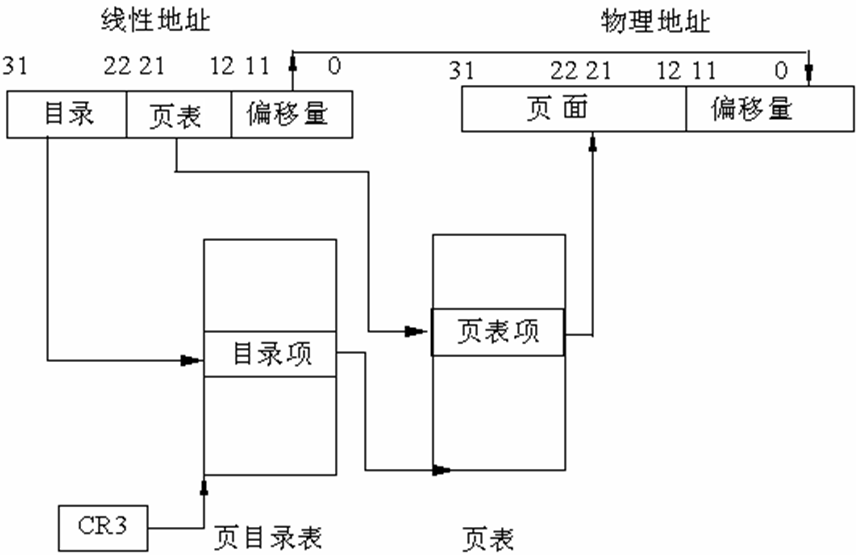

#### 二级模式线性地址转换的特点
* 减少每个进程页表所需RAM的数量
* 一级页表：需要$2^{20}$个表项(每项4字节，共4MB)
* 二级特点：
  * 每个活动进程**必须有一个页目录**，但**不必立即为进程的所有页表分配RAM**
  * 只为进程**实际使用的那些虚拟内存区请求页表**来减少内存需求
  * 页目录和页表都可以多达1024项$(2^{10})$
  * 一个页目录的寻址能力$1024\times1024\times4096=2^{32}$

#### 线性地址到物理地址的转换
* 第一步：形成**页表地址**
  * CR3包含着页目录的起始地址，用32位线性地址的最高10位A31～A22作为页目录的页目录项的索引，将它**乘以4(每项4个字节)**，与CR3中的页目录的起始地址相加，形成相应**页表地址**。
* 第二步：形成**页面地址**
  * 从指定的地址中取出32位页目录项，它的低12位为0，这32位是页表的起始地址。用32位线性地址中的A21～A12位作为页表中的页面的索引，将它**乘以4**，与页表的起始地址相加，形成32位**页面地址**。
* 第三步：形成32位物理地址
  * 将A11～A0作为相对于页面地址的偏移量，与32位页面地址相加，得到物理地址。

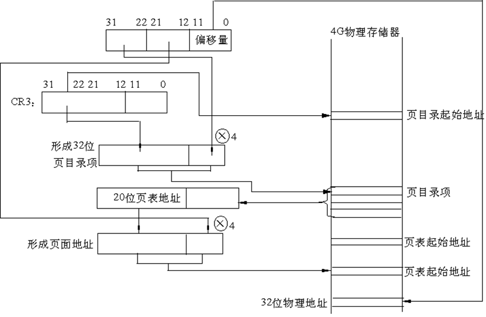

> * 线性地址空间是0x20000000到0x2003ffff(256KB)
>   * 空间大小为0x40000，即0x40个页(64页)

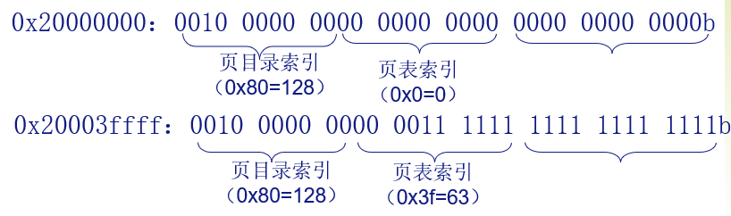

#### Linux进程的分页机制
* Linux的分段机制
  * 所有进程使用相同的段寄存器值及线性地址空间（0～4G）
* Linux对进程的处理很大程度上依赖于分页
  * 实际上，由硬件提供的MMU将线性地址自动转换为物理地址使得一下设计目标变得可行
  * 每个进程都有它自己的页全局目录和自己的页表集合

### 2. Linux页框管理
#### Linux的虚拟空间
* 每个进程拥有**3G用户空间**
* 内核占用**最高1G作为系统空间**
  * **系统空间由所有进程共享**

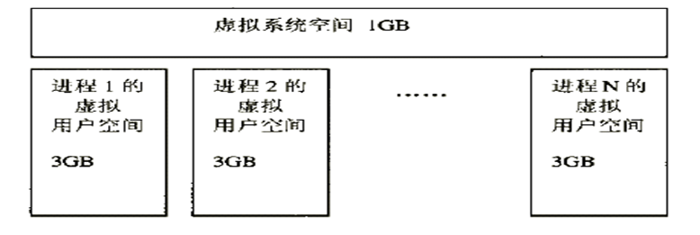
* 内存管理
  * **动态管理内核线性虚拟空间**
    * 物理地址空间到虚拟地址空间的映射
    * 属于稀缺资源，页框及内存区的分配与优化
      * 按需分配，不需要时释放
* 进程地址空间
  * **管理进程虚拟地址空间**
    * 编程地址空间与进程虚拟地址空间的映射
    * 进程虚拟地址空间与物理地址空间的映射

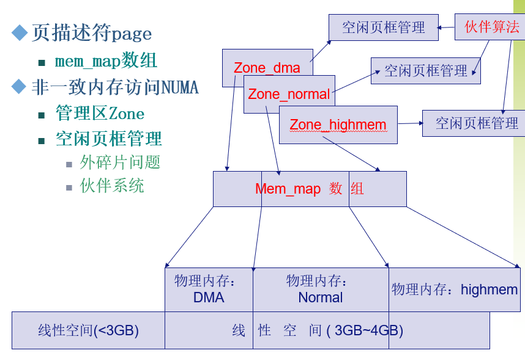

#### 页框设计
* 采用页作为内存管理的基本单位
* 标准页框大小为4KB
* 4KB是大多数磁盘块大小的倍数
  * 传输效率高
  * 管理方便

#### 页描述符
* 每个物理页框都用一个页描述符表示
* struct page 32字节
* 所有物理页框的描述符，组织在mem_map[]中
  * 所需空间略小于整个RAM的1%
  * virt_to_page(addr)宏产生线性地址addr对应的页描述符地址
  * pft_to_page(pfn)宏产生与页框号pfn对应的页描述符地址

#### 页框分配器
* 对连续页框组的内存分配请求
  * 接受动态内存分配与释放的请求
  * **页框被命名为伙伴系统**（Buddy system）
  * **每个管理区分配器有不同的伙伴系统**
  * **高速页框缓存用于快速满足对单个页框的分配请求**

#### 页框管理导致的外碎片问题
* 内核连续页框分配请求导致外碎片问题
  * 频繁的请求和释放不同大小的一组连续页框，必然**导致在物理页框中分散许多小块的空闲页框**
  * 这样，即使有足够的空闲页框页框满足请求，但要分配一个大块的连续页框可能就无法满足
* 解决方法
  * 利用MMU将非连续的物理页框映射到连续的线性地址空间
  * 避免为满足小空闲块而对打开空闲块进行分割(Linux使用这种方法)
#### 伙伴系统
* 所有空闲页框分组为10个块链表
  * 每个链表包含大小为$2^0\cdots 2^9$个连续页框(1~512)
* 每个块的**第一个页框的物理地址**是**该块大小的整数倍**
#### 基于管理区的伙伴系统
* 每个zone使用独立的伙伴系统(DMA, Normal, HighMem)
* 数据结构
  * 页描述符数组zone_mem_map
  * 空闲内存管理数组free_area
  * 位图数组map
#### 伙伴
* 大小相同
* 物理地址连续
* 伙伴大小为b，则第一个伙伴第一个物理页框的地址为$2\times b\times 4KB$的整数倍
* 通过对大块物理内存划分而来。
* 若两伙伴都空闲，合并为更大的伙伴直到不能合并为止
#### 位图
* 一对伙伴使用一位
  * 0：状态一致，都空闲/使用
    * 如果全空闲，必然被合并了
    * 两种情况下，对应的块数据结构都不在此free_area_t结构中
  * 1：状态不一致
    * 对应的块数据结构在此free_area_t结构链表中

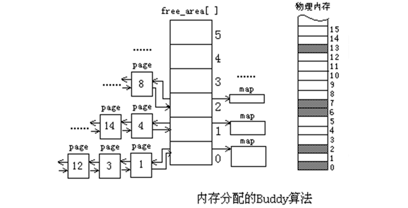
* **块分配**函数：__rmqueue(zone, order)
* **块释放**函数：__free_pages_bulk(page, zone, order)
  * > 128MB最多可以分成215=32768个页框，214=16384个8KB（2页）的块或213=8192个16KB（4页）的块，直至64个大小为512个页的块
  * > free_area[0]对应的位图由16384位组成，每对伙伴（大小为1个页框）对应其中的一位
  * > free_area[1]对应的位图由8192位组成，每对伙伴块（大小为2页）对应其中的一位
  * > free_area[9]对应的位图由32位组成，每对伙伴（大小为512页）对应其中的一位

#### 内存区管理的问题
* 基于页面的分配器**不能满足多种要求**
  * 内核中大量使用各种数据结构，都整到2的幂次个页面完全不现实
* 早期Linux解决方法
  * 提供大小为2,4,8,16,...,131056字节的内存区域
  * 需要新的内存区域时，内核从伙伴系统申请页面，把它们划分成一个个区域，取一个来满足需求
  * 如果某个页面中的内存区域都释放了，页面就交回到伙伴系统 
* 缺陷
  * 不同数据类型用不同的方法分配内存可能提高效率
  * 内核的函数常常**重复地使用同一类型的内存区**，缓存最近释放的对象可以加速分配和释放
  * 对内存的请求可以**按照请求频率**来分类，频繁使用的类型使用专门的缓存，很少使用的可以使用通用缓存
  * 使用**2的幂次大小的内存区域时硬件高速缓存冲突的概率较大**，有可能通过仔细安排内存区域的起始地址来减少硬件高速缓存冲突 
  * **缓存一定数量的对象可以减少对buddy系统的调用**，从而节省时间并减少由此引起的硬件高速缓存污染
 

 #### slab分配器
* 将内存区看成**对象**
* 将对象**按照类型分组成不同的高速缓存**
  * 打开一个文件时存放相应所需的内存是从一个叫做filp的slab分配器的高速缓存中得到的，即每**种对象类型对应一个高速缓存**
* slab分配器通过伙伴系统分配页框
* 每个slab由一个或多个连续的页框组成，这些页框中**包含已分配的对象**，**也包含空闲的对象**
* 三种状态
  * 全满，半满，全空
* 分配策略：优先使用半满，其次全空，没有空slab则向buddy系统申请一个新slab

### 3. Linux进程地址空间管理
#### 进程虚拟空间
* 分为内核区和用户区
  * 操作系统代码与数据映射到内核去
  * 进程可执行映像映射到用户区
  * 一个进程所需的虚拟空间中的各个部分未必连续，形成若干离散的虚存“区间”(VM area)
  * 一个VMA的**虚拟空间是连续**的并且**有相同的一些属性**
#### 进程内存组织相关数据结构
* 每个进程有且**只有一个**mm_struct描述进程虚拟内存
* vm_area_struct描述进程虚拟内存地址区域（线性区）
  * 每个进程可以有多个VMA
  * 对页错误处理有同一规则的进程虚拟内存空间部分，如共享库、堆栈
* page结构描述一个物理页

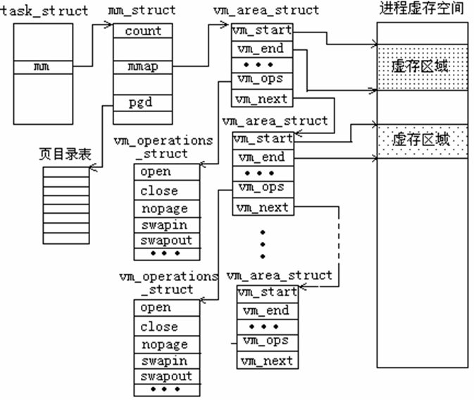

#### 内存描述符
* mm_struct
  * 所有内存描述符在mmlist字段组成的双向链表中，**第一个元素为init_mm**，是进程0的内存描述符
  * mm_users：共享mm_struct的轻量级进程的个数
  * mm_count：内存描述符的住使用计数器

#### 线性区
* vm_area_struct
  * 地址空间内**连续区间上**的一个**独立内存范围**
  * 开始，结束地址**4KB对齐**
  * 进程**只能访问某个有效的线性区**
  * 区间中的地址有相同的属性，如同样的存取权限和相关操作函数
  * 可以表示i各种线性区
  * vm_avl_left：**左指针**指向相邻的**低地址**虚拟区域
  * vm_avl_right：**右指针**指向相邻的**高地址**虚拟区域
* 线性区**从来不重叠**
* 进程中每个**单独区域**对应一个**不同内存区**，如
  * 堆栈、二进制代码、全局变量、文件映射等等
* 内核尽力将新分配的线性区与紧邻的现有线性区合并
  * 如果两个相邻区的访问权限相匹配

