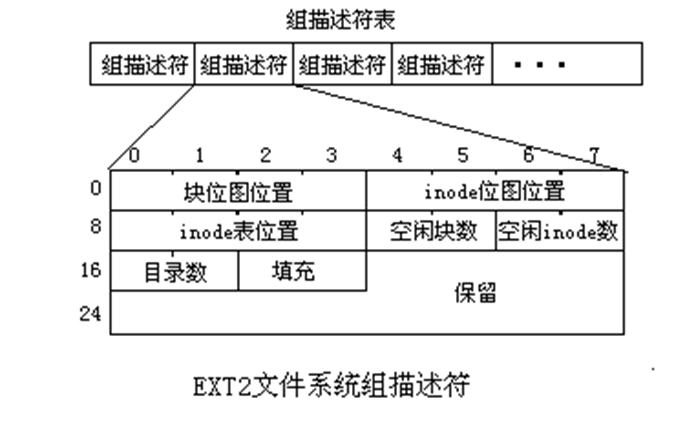

## Chap7 Linux文件系统
* 什么是VFS？VFS的作用？VFS的框架？VFS如何实现与实际文件系统的映射？
* 以write()系统调用为例，说明VFS是如何与具体文件系统,如ext2相结合的？
* 什么是I节点（内存I节点、磁盘I节点）？VFS的索引节点与具体的文件系统的索引节点有什么联系？
* 目录项结构与索引节点有何区别？为什么不把两者合二为一？
* 掌握相关的数据结构：作用、重要域的含义
  * Super_block 、 Inode  、 Files_struct  、File、Dentry、Vfsmount、File_system_type
* Super_block结构中设置u域的意图是什么？
* 目录项的组织
* 掌握linux的目录和文件的访问过程（结合实例）
* 文件系统的注册和安装有何不同？何时进行？
* 文件系统的注册、安装、卸载的过程?当文件系统正在使用时能够卸载？
* 如何描述已安装的、已注册的文件系统？
* 进程与文件系统的联系
  * 数据结构：Files_struct/fs_struct/file：作用
  * 系统打开文件表、用户打开文件表，及它们间的关系
  * 文件共享的实现：讲义中的例子
* Ext2文件系统
  * 特点及物理结构：块组、超级块、块组描述符
  * 文件数据在磁盘上的组织：多重索引(15项）

### 7.1 Linux文件系统概述
* Linux文件系统**特征**：
  * 树形结构
  * 文件时无结构的字符流式文件
  * 权限保护
  * 外部设备也被看作文件

* **文件类型**：
  * 普通文件
  * 目录文件：由目录项组成，每个目录项(文件名， inode号)
  * 设备文件：不占实际物理存储块
  * 管道文件，链接文件
* **安装**
  * 将一个文件系统的顶层目录挂到另一个文件系统的子目录上，使他们成为一个整体。
  * 该子目录称为**安装点**
  * 安装点原本的内容会被按章的文件系统覆盖。
* EXT2是Linux的标准文件系统，作为根文件系统。其他文件系统安装在根文件系统的某个目录下。

### 7.2 虚拟文件系统VFS
* 虚拟文件系统VFS--Virtual File System
  * 是一个软件层，用来处理与Linux/Unix标准文件系统相关的所有系统调用
    * 是用户应用程序与文件系统实现之间的抽象层
  * 能为各种文件系统提供一个**通用的、统一的接口**
* Linux文件系统的组成
  * 上层文件系统的系统调用
  * 虚拟文件系统
  * 挂载到VFS中的各种实际文件系统，如EXT2
* VFS的**作用**
  * **接收**对文件系统的**访问操作请求**，通过VFS的操作函数，按照一定的映射关系把这些**访问重新定向到实际文件系统中的相应的函数调用**
  * 真正与物理结构有关的具体操作由实际文件系统完成。
  * 上下两类接口
    * **上层接口是提供给用户使用**。通过该接口使用I/O系统，如打开，关闭等
    * **下层接口**提供给**真实文件系统**。VFS支持的每个真实文件系统都提供对这个接口的实现。

* VFS通过对每一个具体的文件系统的**抽象**，使得Linux用户能**用统一接口使用不同的文件系统**
* VFS存在于**内存中**

### 7.3 VFS的数据结构
* superblock object:超级块对象
  * 存放文件系统相关信息：文件系统控制块
* inode object:索引节点对象
  * 存放具体文件的一般信息:文件控制块/inode
* file object:文件对象
  * 存放一打开的文件和进程之间交互的信息
* dentry object:目录项对象
  * 存放目录项与文件的链接信息

* superblock:
  * 描述**已安装的文件系统**的信息，**全局数据结构**
    * 设备标识符、索引节点指针、数据块大小、超级块操作集、文件系统类型、文件系统的特殊信息。
  * **VFS超级块**位于内存中，在文件系统安装时建立，在卸载时自动删除
  * 各文件系统**有自己的超级块**，存放于**磁盘上**。
  * 所有超级块以双线链表形式链接在一起，s_list对象为链表指针
  * super_operations数据结构表示超级块操作
    * 超级块有对应的唯一的设备号，不需要真实设备的自动分配0的匿名设备
* superblock的U域
  * 实现支持多种文件系统的**关键**。指向VFS所支持的各种具体文件系统的超级块。
  * > 如当在系统上安装了另一个文件系统（比如DOS的FAT）时，那么DOS的超级块就被复制到内存的msdos_sb_info结构中。
  * >由于联合体类型数据成员super_block.u.msdos_sb指向该结构体，以后就允许该文件系统直接对内存超级块u域进行操作，无需再去访问磁盘，以提高系统效率。
  * 设置一个s_dirt标志表示是否需要更新磁盘上的数据，周期性写回脏数据。
* 超级块的操作
  * 超级块的操作由struct super_operations(抽象类)描述，存放在s_op中。
  * 每个**具体文件系统**都应该提供super_opeartaion中函数的**具体实现**。
  * super_opertaions是一个抽象类，只提供了接口，并未实现。ext2_sops， fat_sops等是具体类，实现了对应的接口。
* VFS Inode
  * VFS中每一个文件、目录都用且**只用一个VFS inode**表示。
  * 每个**索引节点对象都有一个索引节点号**，这个号**唯一的表示某个文件**系统中的指定文件
  * 文件名可以随意更改，但索引节点对文件是唯一的，随文件的存在而存在。
  * **具体文件系统的索引节点**是存放在**磁盘上**的，是一种**静态结构**，使用时必须调入内存，填写VFS的索引节点。因此称VFS索引节点是动态节点
  * **索引节点由struct inode标识，方法保存在struct inode_operations**
* VFS inode的U域
  * 存储每一个特定文件系统的特定inode
  * 如果索引节点指向的是一个ext2文件，那么该U域就指向一个ext2_inode_info结构；
  * **每个索引节点都要复制磁盘索引节点得到**
* dentry:目录项
  * inode中**没有文件路径域文件名**
  * 目录文件包含该目录中所包含的文件名和子目录名
  * 一个文件可以有多个文件名、路径名(一个文件可以出现在多个目录中)，引入dentry结构描述目录与文件的关系树。
  * 每个目录和文件有一个目录项结构
  * 引入目录项是为了**方便查找文件**
    * 一个路径的各个组成部分，不管是目录还是普通的文件，都是一个目录项对象
    * **目录项对象没有对应的磁盘数据结构**，在VFS遍历路径名的过程中逐个解析
    * 

### 7.4 文件系统安装与注册
* 使用文件系统前必须进行注册
  * 时机
    * 系统初启动时；把某个文件系统作为内核模块显示安装时。
* 注册用到的**数据结构**
  * **struct file_sytem_type**表示一个文件系统类型，只包含一个read_super方法，用于**读出该文件系统在辅存中的超级块**
  * 内核每个已注册的文件系统都存放在file_system_type链表中。该链表头部由file_system指示。
  * 系统引导时，由filesystem_setup()注册，根据file_system_type调用注册函数regsiter_filesystem()，将file_system_type插入file_system链表中。

* 文件系统**安装**
  * 安装用于**建立文件系统的VFS超级块**
  * 安装与卸载一般只能由超级用户root完成。
  * 安装文件系统需要**文件系统类型、文件系统所在设备以及挂装点**
  * 时机：
    * 系统启动自动安装；通过mount命令安装

* 安装用到的**数据结构**
  * **vfsmount**：描述已安装文件描述符，内核中是一个双向链表，首指针为**mnt_list**

### 7.5 Linux文件和目录访问
* 在VFS中定位给定文件的索引节点
  * VFS每次分解文件路径名中的一个目录名
  * 一次搜索每个中间目录名的VFS索引节点。
* 访问过程
  * 首先得到文件系统根目录对应的inode，读取其中的信息，根据文件类型判定是一个目录文件，在这个inode保存的目录项列表中找到名称为home的那一项，查找该目录项就可以得到这个子目录对应的inode，然后再读取该inode的信息；
  * 每一个目录文件中都保存着自己所包含文件和直接子目录的目录项，逐个查找，最终可以找到所需要文件的inode号，访问相应的inode，通过该inode的索引表，得到存储文件内容的物理块，就得到了指定文件的内容。

### 7.7 Linux进程与文件系统的联系
* files_struct:
  * 作用：描述**被进程打开使用的文件**信息。
    * fd成员指向一个struct file数组，数组中的已使用项指向某个正被打开的文件对象
* fs_struct:
  * 作用：描述进程与文件系统的关系。
    * pwd指向当前工作目录的索引节点；root指向当前工作目录所在文件系统的根目录的索引节点
* file:
  * 作用：表示文件
    * 操作函数，保存在struct file_operations。这些操作用来将**VFS对file结构的操作**转化为**文件系统处理相应操作的函数**。
* 系统打开文件表：所有进程**打开的文件**
  * file结构组成的双向链表，表头为first_file
  * 每次打开一个文件就新建一个file结构体，加入链表
  * file结构，储存一个已打开文件的管理控制信息

* 进程打开文件表:fd[]
  * fd[]每个元素是一个指向file结构体的指针
  * 进程每打开一个文件时，建立一个file结构体，并加入到系统打开文件表中，然后把该file结构体的首地址写入fd\[\]数组的第一个空闲元素中。fd\[\]数组的下标称为文件标识号。
  * 进程使用文件名打开一个文件。 在此之后对文件的识别就不再使用文件名，而直接使用文件标识号。
* 文件共享
  * fork()创建一个子进程后，子进程共享父进程的打开文件表，两者的打开文件表中下标相同的两个元素指向同一个file结构。 这时file的f_count计数值增1。
  * 一个文件可以被某个进程多次打开，每次都分配一个file结构，并占用该进程打开文件表fd[]的一项，得到一个文件标识号。但它们的**file中的f_inode都指向同一个inode**。

.png)

### 7.8 Linux文件系统(EXT2)
* **特点：**
  * 支持LINUX文件类型：普通文件、目录文件、特别文件和符号链接
  * 管理大分区
  * 支持长文件名
  * 支持文件系统数据“即时同步”特性
  * 允许用户定制文件系统数据单元大小
* **物理结构：**
  * 一个**磁盘分区**由**一组连续的柱面**组成。
  * 传统Unix文件系统
    * 访问文件需要两次磁盘访问：一次读inode，一次读文件
    * 所有inode存放在文件系统的开始位置，其余磁道存放数据块。两次磁盘操作需要花费**较长寻道时间**。
  * Linux改进
    * 将磁盘分区分成**多个柱面组**，每个柱面组有**一或几个连续的柱面**
    * 每个柱面组由超级块、i节点和空闲块表组成
    * **将与i节点相关的文件数据与i节点放在同一柱面内**，**减少寻道时间**。
    * 文件创建时，任选一个i节点，优先在该i节点所在的柱面中分配数据块。

* **磁盘组织**
  * EXT2把它所占用的磁盘逻辑分区划分为块组，**第一个磁盘块用于引导块**，其余部分被分成块组。
  * 所有的组大小相同并且顺序存放，所以由组的序号可以确定组在磁盘上的位置。
  * 每一个块组依次包括超级块、组描述符表、块位示图、inode位示图、inode表以及数据块。
    * 块位示图：记录本组各个数据块的使用情况；
    * inode位示图：记录inode表中inode的使用情况。
    * inode表：保存了本组所有的inode
    * 数据块：用于存放数据
      * inode用于描述文件。一个inode对应一个文件和子目录，有一个**唯一的inode号**，并记录了文件在外存的位置、存取权限、修改时间、类型等信息。
  * 每个块组重复保存着一些有关整个文件系统的关键信息，**可以提高文件系统的可靠性**
    * 在每个块组中都有一份拷贝， 从而当文件系统意外出现崩溃时可以很容易地恢复它。

* **系统引导块**
  * 系统引导块总是磁盘上的**第一个数据块**，**只有根文件系统才有引导程序**放在这里，**其余文件系统都不使用引导块**。 
* **超级块**
  * 每个块组的第一个磁盘块用来保存超级块
  * 一般来说只有组0的超级块才被读入内存超级块，其它块组的超级块仅仅作为备份。当组0的拷贝遭到损坏时，便可根据其他组的拷贝恢复
* **组描述符**
  * 每个块组都有一个组描述符，记录了该块组的块位图位置、inode位图位置、inode节点位置、空闲块数、inode数、目录数等内容
  * 所有的组描述符一个接一个存放，构成了组描述符表。
  * 组描述符表在每个块组中都有备份。

* **inode表**
  * 一个块组中所有文件的inode形成了inode表，存储在一组连续的磁盘块中。表项的序号就是inode号。
  * 在块组中要占用几个逻辑块由超级块中s_inodes_per_group给出。
  * 第一个磁盘块的块号存储在组描述符中的bg_inode_table数据项中。
  * 根据磁盘块的大小，可以计算出每个磁盘块能容纳多少个索引结点
  * 根据索引结点的总个数，可以计算出索引结点表所需要占用的磁盘块的个数。  
* **inode位图**
  * 反映inode表中各个表项的使用情况，它的一位(bit)表示inode表的一个表项，若某位为1表示对应的表项已占用，为0表示表项空闲。
  * inode位图装入一个高速缓存中。
* **内存inde**
  * 除了具有盘索引节点的主要信息外， 还增添了反映该文件动态状态的项目
* **磁盘inode**： 
  * 文件模式，文件属主信息，文件大小，时间戳，文件链接计数，数据块索引表
* **块位图**
  * 描述数据块的使用状况
  * 每个块组都有一个块位图
  * EXT2块位图装入一个高速缓存中，系统采用类似LRU的算法管理高速缓存
* 磁盘组织方式
  * 数据在磁盘上并不一定连续，需要保存各个，磁盘块号。
  * EXT2文件系统采用了多重索引方式。
  * i_data[]的**前12项可看成直接指针**,直接存放文件数据所在的磁盘块号。**第13项是个一级指针**，**第14,15项分别是二级指针和三级指针**。

* EXT2文件系统的不足
  * 先写入文件的内容，空闲时再写入文件的元数据。
    * 元数据：文件的大小、存储位置、权限等等。
  * 突然断电，文件系统就会处于不一致的状态
* **解决**
  * 在分区中保存一个日志记录文件，文件系统写操作首先是对该日志记录文件进行操作，若写操作中断时，下次系统启动时就会读日志记录文件的内容而恢复没有写完的操作，所用时间很短

