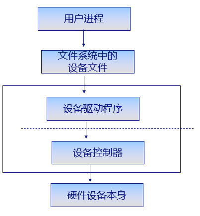
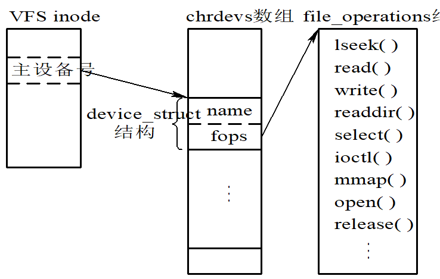
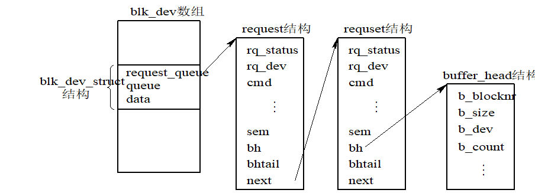

## Chap8 Linux设备管理与模块机制
* 什么是设备文件？什么是设备驱动程序？
* 如何注册字符设备驱动程序？
* 如何理解“在Linux系统中，用户通过文件系统与设备打交道”？
* 为什么Linux使用设备转换表引导设备操作？
* 字符设备与块设备有何区别？
* 为什么一个I/O设备有两个设备号？一个是主设备号，另一个是次设备号
* 将设备和普通文件统一命名的好处是什么？
* 简述Linux的模块机制及其优缺点。

### 1. Linux设备管理概述
* 利用一种通用的方法对所有输入输出设备进行控制。设计一个统一而简单的输入输出系统调用接口。
* 输入输出子系统分为上/下两部分
  * 下层：与设备有关，称为**设备驱动程序**，直接与相应设备打交道，为上层提供一组接口
  * 上层：与设备无关，根据用户的I/O请求，向下通过设备驱动程序接口和设备进行通讯
* Linux中**通过文件系统与设备接口**，利用标准系统调用在设备上进行操作。
  * 系统将I/O请求处理权限放在文件系统，文件系统通过驱动程序提供的接口**将任务下放到驱动程序**
  * **驱动程序**根据需要**对设备控制器操作**
  * **设备控制器控制设备本身**



<div STYLE="page-break-after: always;"></div>

* 内核中设备文件和普通文件的索引节点**有区别**
  * 文件系统中存放方法：文件名+inode号
  * **设备文件**只有一个索引节点，没有存放数据的块组。
* 设备文件
  * **设备文件为对设备的访问接口**
  * 位于目录 **/dev**或其子目录下
  * 命名为**设备文件名**+**数字或字母**
    > /dev/hda, /dev/hda1
* 每个设备号分为**主设备号与次设备号**
  * **主设备号：区分不同种类的设备**
    * 使用相同的驱动
  * **次设备号：区分同一类型的多个设备**
    * 区分具体设备的实例
  * 常用设备有约定俗成的编号，硬盘为3
* 设备分为block与char。块与字符流
  * 字符流设备
    * 像字节流一样访问的设备都通过字符设备来实现，通常在/dev/目录下面
    * **无需缓冲**直接读写设备
    * 通常**只允许按顺序访问**
    * 一般要包含open， read， write， close等系统调用的实现
  * 块设备
    * 磁盘，内存，闪存等可以容纳文件系统的存储设备。
    * 数据按可寻址的块为单位进行处理
    * **可随机访问**
    * **利用缓冲技术**

### 2. Linux设备分类及数据结构
* 每个设备对应**文件系统**中一个**VFS inode**，有一个设备文件名
  * inode中的**i_mode表明类型**：**块：S_IFBLK, 字符流：S_IFCHR**
  * 设备文件对应的inode**没有块列表**，但有i_rdev域，存储主、次设备号。
* **使用open()打开设备**，建立与目标设备的连接
  * 对**设备的使用类似对文件的存取**
  * **设备驱动程序是系统内核的一部分**
  * 对内核而言，设备文件名字无关紧要，关键在于设备文件的类型及其主次设备号。
* **主次设备号**标识设备存在**局限性**
  * /dev中**大多数设备不存在**
  * 8位长主次**设备号不够用**
  * **不容易记忆**
* 介于此，**Linux2.4后引入设备文件系统(devfs)**
* 设备文件vfs处理
  * **访问普通文件**：通过文件系统访问磁盘分区中的数据块
  * **访问设备文件**：驱动硬件设备
    * 设备文件打开时使用与**设备相关的函数调用替换其缺省的文件操作**
<div STYLE="page-break-after: always;"></div>

* 设备文件：i节点
  * 每个设备文件使用**唯一的inode**来标识
  * inode包含，和一组文件操作函数指针相联系
  * **设备文件inode**不指向文件系统中的**任何实际的物理块**，**不占用数据空间**，通过这个i节点可以**访问相应的设备驱动程序**，对设备文件的操作就是直接对设备本身进行相应的操作。


### 3. Linux设备转换表
* 设备转换表是一个数据结构,定义了每个设备必须支持的操作入口点
  * 块设备转换表(blk_dev)
  * 字符设备转换表(chardevs)
  * 根据设备类型和主设备号找到对应驱动函数

用于**注册字符设备的数据结构**
```C++
struct device_struct{
  const char *name;             // 指向已登记的设备名称的指针
  struct file_operations *fops; // 指向设备驱动程序的入口函数
}
```
* 字符设备初始化
  * 注册：**设备驱动添加到chrdevs中**
  * 设备**主设备号标识符固定**
* 使用**主设备号**来**对chrdevs数组进行索引**
* 访问某台设备时，在字符转换表中找到该设备的驱动程序，再由设备驱动程序调用相应的驱动程序函数执行。




### 4. Linux设备的注册与注销
* 字符设备：打开文件操作
  * 使用设备主设备号索引chrdevs数组，得到文件操作函数指针。
  * 建立此字符设备文件的FILE，使文件操作指针指向此设备驱动中的文件操作指针集合
  * 所有应用对它进行的文件操作映射到此字符设备的文件操作集合上
```C++
int register_chrdev(unsigned int major, const char * name, 
struct file_operations *fops);
// chrdevs表最初为空，注册函数向表中插入一个新项
int unregister_chrdev(unsigned int major, const char * name);
// 注：major即设备的主设备号，注册后就是访问数组chrdevs的索引（下标）。
```
* 块设备转换表
```C++
static struct {
  const char *name;
  struct block_device_operations *bdops;  // 只定义了接口，没有函数实现
} blk_devs[MAX_BLKDEV];   // 使用主设备号作为索引
```
<div STYLE="page-break-after: always;"></div>

注册函数
```C++
int register_blkdev(unsigned int major,const char *name, 
struct block_device_operations *bdops)
int unregister_blkdev(unsigned int major, const char * name)
```

### 5. Linux设备操作



### 6. Linux模块机制
* Linux系统使用可动态加卸载内核模块(Loadable Kernel Modules, KLMs)
  * 使得内核可方便地在内核中添加新的组件
  * 提高了linux内核的可扩展性
  * 让内核保持很小的尺寸并非常灵活。
  * 无需重构内核并频繁重新启动来尝试运行新内核代码
* 模块
  * 在内核空间运行
  * 是一种目标对象文件
  * 没有链接，不能独立运行
  * 目标代码通常由一组函数和数据结构组成
* 优点
  * 内核更加**紧凑灵活**
  * 不必重新编译整个内核
  * 目标代码一旦被链接到内核，作用域和静态链接的内核目标代码完全等价
<div STYLE="page-break-after: always;"></div>

* 缺点
  * 系统性能和内存利用方面的损失
  * 模块使用不当可能导致系统崩溃
  * 内核必须维护符号表，装入和卸载时修改符号表
  * 内核要维护模块间的依赖性
* 模块依赖
  * 模块B被模块A引用：一个模块A引用另一个模块B所导出的符号

* 内核模块引入的问题
  * 有可能同时带来与内核模块相关的性能与内存损失
  * Linux内核模块也可以象所有内核代码和设备驱动一样使内核崩溃。 
  * 内核必须维护符号表，并在装入和卸载模块时修改这些符号表。 
  * 内核要维护模块之间的依赖性。
  * 必须能够在卸载模块时通知模块，并且要释放分配给模块的内存和中断等资源
  * 内核版本和模块版本的不兼容，也可能导致系统崩溃
